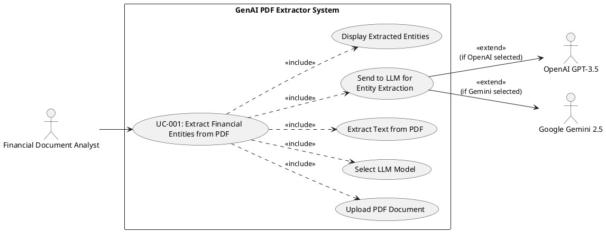

# Codebase Analysis

## 1. Executive Summary

### System Overview
GenAI PDF Extractor is a Django-based web application that extracts structured financial entity data from PDF documents using Large Language Models (OpenAI GPT and Google Gemini). The system processes uploaded PDF files, extracts text using PyMuPDF, and leverages LLMs to identify and extract financial loan documentation entities including lender information, borrower details, loan terms, and location data. The application serves as a proof-of-concept for AI-powered document intelligence in the financial services domain.

---

## 2. Technology Stack Inventory

### Technology Stack Summary
Python-based monolithic web application built on Django 4.2.16 framework with AI/ML capabilities through OpenAI and Google Generative AI integrations. Uses SQLite for data persistence, PyMuPDF for PDF processing, and includes LangChain framework (currently unused). No containerization, CI/CD, or infrastructure-as-code detected.

### Languages & Frameworks
| Category | Technology | Version | Purpose | Health Status | Notes |
|----------|------------|---------|---------|---------------|-------|
| Language | Python | 3.x | Primary application language | Active | Version not pinned in requirements |
| Framework | Django | 4.2.16 | Web framework | Active | LTS version, security updates available |
| Runtime | WSGI | Built-in | Production server interface | Active | Using Django dev server (not production-ready) |
| AI Framework | LangChain | 0.3.4 | LLM orchestration | Active | Installed but unused in codebase |
| AI Framework | LangChain Community | 0.3.3 | LLM integrations | Active | Installed but unused |
| AI Framework | LangChain Core | 0.3.13 | Core LLM abstractions | Active | Installed but unused |

### Infrastructure & Platform
| Category | Technology | Version | Purpose | Configuration | Notes |
|----------|------------|---------|---------|---------------|-------|
| Database | SQLite | 3.x | Data persistence | Default Django config, single file db.sqlite3 | Not suitable for production, no models defined |
| Cache | None | N/A | N/A | Not configured | No caching layer implemented |
| Queue | None | N/A | N/A | Not configured | No async task processing |
| Cloud | None | N/A | N/A | Not configured | Local deployment only |
| File Storage | Local Filesystem | N/A | PDF uploads | MEDIA_ROOT = media/ | No cloud storage integration |
| AI Services | OpenAI API | GPT-3.5-turbo | Entity extraction | API key hardcoded | Security risk |
| AI Services | Google Gemini | gemini-2.5-pro-exp-03-25 | Entity extraction | API key hardcoded | Security risk |
| PDF Processing | PyMuPDF (fitz) | Latest | Text extraction | Default config | Synchronous processing |
| OCR | Tesseract | 0.3.13 | Image-based PDF text extraction | pytesseract wrapper | Not actively used |

### DevOps Tooling
| Category | Tool | Version | Purpose | Notes |
|----------|------|---------|---------|-------|
| Build | None | N/A | N/A | No build automation detected |
| CI/CD | None | N/A | N/A | No pipeline configuration found |
| Monitoring | None | N/A | N/A | No APM or logging infrastructure |
| Testing | None | N/A | N/A | No test framework configured |
| Containerization | None | N/A | N/A | No Dockerfile or docker-compose.yml |
| Version Control | Git | N/A | Source control | .gitignore present |

---

## 3. Source Code Organization

### Repository Structure

#### Frontend Applications
```
extractor_app/templates/
└── index.html                 # Single-page UI for PDF upload and entity display
```
**Notable Patterns**: Minimal frontend with inline CSS, no JavaScript framework, server-side rendering only.

#### Backend Services
```
genai_pdf_extractor/           # Django project root
├── __init__.py
├── settings.py                # Application configuration
├── urls.py                    # Root URL routing
├── wsgi.py                    # WSGI entry point
└── asgi.py                    # ASGI entry point (unused)

extractor_app/                 # Main application module
├── __init__.py
├── admin.py                   # Django admin (empty)
├── apps.py                    # App configuration
├── forms.py                   # Upload form definition
├── models.py                  # Database models (empty)
├── urls.py                    # App URL routing
├── views.py                   # Main view logic (active)
├── view_old.py                # Deprecated view (duplicate code)
├── tests.py                   # Test suite (empty)
├── llm_backends/              # LLM abstraction layer
│   ├── __init__.py
│   ├── openai_backend.py      # OpenAI integration class (unused)
│   └── gemini_backend.py      # Gemini integration class (unused)
├── migrations/                # Database migrations
│   └── __init__.py
└── templates/
    └── index.html
```
**Notable Patterns**: 
- Monolithic structure with single app
- LLM backend abstraction exists but not utilized
- Duplicate code in views.py and view_old.py
- No separation between business logic and presentation layer

#### Shared Libraries
```
None detected
```
**Notable Patterns**: No shared library structure, all code in single Django app.

#### Infrastructure as Code
```
None detected
```
**Notable Patterns**: No IaC, containerization, or deployment automation.

---

## 4. Technical Architecture

### Design Patterns Identified
| Pattern Type | Pattern Name | Usage | Location |
|--------------|--------------|--------|----------|
| Architectural | Monolithic Architecture | Single Django application handling all concerns | Entire codebase |
| Architectural | MVC (Model-View-Template) | Django's MTV pattern | Django framework default |
| Design | Strategy Pattern (Partial) | LLM backend abstraction for swappable AI providers | `extractor_app/llm_backends/` |
| Design | Template Method | Django class-based views structure | Django framework |
| Integration | Direct API Integration | Direct calls to OpenAI and Gemini APIs | `views.py:50-61` |
| Integration | File Upload Pattern | Multipart form data handling | `views.py:78-88` |

### Anti-Patterns Detected
| Anti-Pattern | Impact | Location | Remediation |
|--------------|---------|----------|-------------|
| God Object (Fat Controller) | All business logic in single view function, violates SRP | `views.py:extract_view()` | Extract to service layer, implement repository pattern |
| Hardcoded Configuration | API keys in source code, security vulnerability | `views.py:16`, `settings.py:127-128` | Move to environment variables, use secrets manager |
| Dead Code | Unused LLM backend classes, maintenance burden | `llm_backends/` directory | Remove or integrate properly |
| Copy-Paste Programming | Duplicate code in views.py and view_old.py | `view_old.py` | Delete deprecated file, use version control |
| Magic Numbers | Hardcoded max_tokens=500, temperature=0.2 | `views.py:54` | Extract to configuration constants |
| Synchronous I/O in Web Handler | Blocking PDF processing and LLM calls | `views.py:extract_view()` | Implement async task queue (Celery/Redis) |
| No Error Boundaries | Generic exception catching without proper handling | `views.py:28, 66` | Implement specific exception handlers |
| CSRF Bypass | @csrf_exempt decorator disables security | `views.py:70` | Remove decorator, implement proper CSRF handling |

### System Topology
- **Entry Points**: 
  - HTTP: `http://localhost:8000/` (Django development server)
  - Admin: `http://localhost:8000/admin/` (Django admin interface)
  
- **Communication Protocols**: 
  - HTTP/HTTPS for web requests
  - REST API calls to OpenAI (https://api.openai.com)
  - REST API calls to Google Gemini (https://generativelanguage.googleapis.com)
  
- **Data Flow**: 
  1. User uploads PDF via HTML form (POST multipart/form-data)
  2. Django saves file to local filesystem (media/uploads/)
  3. PyMuPDF extracts text synchronously
  4. Text sent to selected LLM (OpenAI or Gemini) with hardcoded prompt
  5. LLM response returned as JSON
  6. Results rendered in HTML template
  
- **External Integrations**: 
  - OpenAI GPT-3.5-turbo API
  - Google Gemini 2.5 Pro API
  - No webhooks, message queues, or async processing

---

## 5. Application Inventory

### Applications & Services

#### GenAI PDF Extractor Web Application
- **Type**: Web Application (Django)
- **Entry Point**: `manage.py` (Django management command)
- **Build Command**: `pip install -r requirements.txt`
- **Run Command**: `python manage.py runserver`
- **Default Port**: 8000
- **Environment Variables**:
  - `OPENAI_API_KEY`: OpenAI API authentication key (currently hardcoded)
  - `GEMINI_API_KEY`: Google Gemini API authentication key (currently hardcoded)
  - `DJANGO_SETTINGS_MODULE`: Django settings module path (default: genai_pdf_extractor.settings)
  - `SECRET_KEY`: Django secret key for cryptographic signing (currently exposed)
  - `DEBUG`: Debug mode flag (currently True - security risk)
- **Dependencies**: 
  - Django 4.2.16 (web framework)
  - openai (OpenAI SDK - deprecated methods used)
  - google-generativeai 0.8.3
  - PyMuPDF (fitz) for PDF parsing
  - python-dotenv 1.0.1 (for .env file loading)
  - LangChain 0.3.4 (installed but unused)
- **Health Check**: No health check endpoint implemented
- **Purpose**: Accept PDF uploads, extract text, send to LLM for financial entity extraction, display results

---

## 6. Critical Business Logic

### Core Business Logic Classes
| Class/Module | Location | Business Purpose | Key Methods | Business Rules | Dependencies |
|--------------|----------|------------------|-------------|----------------|--------------|
| extract_view (function) | `extractor_app/views.py:71-111` | Orchestrates PDF upload, text extraction, and LLM entity extraction | extract_view(), extract_text_from_pdf(), extract_entities_from_model() | Accepts only POST requests with pdf_file, requires model selection | Django request handling, PyMuPDF, OpenAI SDK, Google GenAI SDK |
| extract_text_from_pdf (function) | `extractor_app/views.py:22-29` | Extracts raw text from PDF documents | extract_text_from_pdf(file_path) | Returns error string if PDF parsing fails | PyMuPDF (fitz) |
| extract_entities_from_model (function) | `extractor_app/views.py:32-67` | Sends extracted text to LLM with financial entity extraction prompt | extract_entities_from_model(extracted_text, selected_model) | Validates model selection (openai/gemini), enforces JSON response format | OpenAI API, Google Gemini API |
| OpenAIBackend (class) | `extractor_app/llm_backends/openai_backend.py:3-13` | Abstraction for OpenAI API calls (UNUSED) | __init__(api_key), extract_info(prompt) | Uses GPT-4 model, temperature=0 | OpenAI SDK |
| GeminiBackend (class) | `extractor_app/llm_backends/gemini_backend.py:3-10` | Abstraction for Gemini API calls (UNUSED) | __init__(api_key), extract_info(prompt) | Uses gemini-pro model | Google GenAI SDK |

### Business Process Flows
| Process Name | Entry Class | Flow Description | Critical Decision Points | Error Handling |
|--------------|-------------|------------------|--------------------------|----------------|
| PDF Entity Extraction | `views.extract_view` | 1. User uploads PDF via form<br>2. File saved to media/uploads/<br>3. PyMuPDF extracts text<br>4. Text sent to selected LLM with financial entity prompt<br>5. LLM returns JSON entities<br>6. Results displayed in UI | Model selection (OpenAI vs Gemini) at step 4 | Generic try-catch returns error strings, no retry logic, no validation |
| Text Extraction | `views.extract_text_from_pdf` | 1. Open PDF with PyMuPDF<br>2. Iterate pages<br>3. Extract text per page<br>4. Join with newlines<br>5. Close document | None | Returns error string on exception, no specific error types |
| LLM Entity Extraction | `views.extract_entities_from_model` | 1. Construct financial entity prompt (hardcoded)<br>2. Route to OpenAI or Gemini based on selection<br>3. Call API with prompt<br>4. Return response text | Model routing (if/elif) at step 2 | Returns error string on exception, no rate limit handling, no token validation |

### Business Rule Validation
| Rule Category | Implementation Location | Description | Validation Logic | Failure Impact |
|---------------|------------------------|-------------|------------------|----------------|
| File Upload | `views.extract_view:78` | Only process POST requests with pdf_file | Check request.method == 'POST' and request.FILES.get('pdf_file') | Silent failure, returns empty template |
| Model Selection | `views.extract_entities_from_model:49-64` | Only accept 'openai' or 'gemini' as model choice | if/elif/else validation | Returns "Invalid model selected" error string |
| LLM Response Format | `views.extract_entities_from_model:46` | Enforce JSON response format from LLM | Prompt instruction only, no schema validation | No enforcement, relies on LLM compliance |
| Financial Entity Schema | `views.extract_entities_from_model:33-42` | Extract specific financial loan entities (Lender, Borrower, Terms, Location, Person) | Prompt engineering only, no code validation | No validation, accepts any LLM output |
| File Type Validation | None | No validation that uploaded file is actually PDF | Not implemented | Security risk: arbitrary file upload |
| File Size Validation | None | No maximum file size limit | Not implemented | DoS risk: large file uploads |

---

## 7. API & Route Inventory

### UI Routes
| Route Path | Component | Purpose | Authentication |
|------------|-----------|---------|----------------|
| `/` | `extractor_app.views.extract_view` | PDF upload form and entity extraction results display | None |
| `/admin/` | `django.contrib.admin.site` | Django admin interface | Django auth (not configured) |
| `/media/uploads/<filename>` | Static file serving | Serve uploaded PDF files for iframe display | None (public access) |

### API Endpoints
| Method | Path | Purpose | Authentication | Rate Limit |
|--------|------|---------|----------------|------------|
| GET | `/` | Display upload form | None | None |
| POST | `/` | Process PDF upload and extract entities | None (CSRF disabled) | None |
| GET | `/admin/` | Access Django admin | Django session auth | None |

### Background Jobs
| Job Name | Trigger | Schedule | Purpose | Dependencies |
|----------|---------|----------|---------|--------------|
| None | N/A | N/A | No background jobs implemented | N/A |

### Message Queues/Events
| Topic/Queue | Producer | Consumer | Message Type | Purpose |
|-------------|----------|----------|--------------|---------|
| None | N/A | N/A | N/A | No message queue infrastructure |

---

## 8. User Journey & Use Case Analysis

### Discovered Actors & System Interactions
*Based on reverse engineering of routes, API endpoints, and authentication patterns*

| Actor Type | Actor Name | Evidence Location | Key Interactions | Access Level |
|------------|------------|-------------------|------------------|--------------|
| Primary | Financial Document Analyst | `views.py:71`, `templates/index.html` | Upload PDF, select LLM model, view extracted entities | Unrestricted (no auth) |
| System | OpenAI GPT-3.5 | `views.py:50-56`, `requirements.txt:9` | Receive text + prompt, return JSON entities | API key authentication |
| System | Google Gemini 2.5 Pro | `views.py:58-61`, `requirements.txt:26` | Receive text + prompt, return JSON entities | API key authentication |
| System | File System | `views.py:83-88`, `settings.py:125` | Store uploaded PDFs in media/uploads/ | Local filesystem access |

### Discovered Use Case Specifications

#### UC-001: Extract Financial Entities from PDF Document
- **Actor(s)**: Financial Document Analyst
- **Goal**: Extract structured financial loan data from unstructured PDF documents
- **Preconditions**: 
  - User has access to web application
  - PDF document contains financial loan information
  - At least one LLM API key is configured
- **Success Scenario**: 
  1. User navigates to application homepage (/)
  2. User selects PDF file from local filesystem
  3. User selects LLM model (OpenAI or Gemini) from dropdown
  4. User clicks "Upload" button
  5. System saves PDF to media/uploads/ directory
  6. System extracts text from PDF using PyMuPDF
  7. System sends text to selected LLM with financial entity extraction prompt
  8. LLM returns JSON-formatted entity data
  9. System displays extracted entities and PDF preview side-by-side
- **Extensions/Alternatives**:
  - 3a. User selects non-PDF file → System attempts processing (no validation)
  - 6a. PDF is encrypted or corrupted → System returns error message
  - 7a. LLM API rate limit exceeded → System returns error message
  - 7b. LLM API key invalid → System returns error message
  - 8a. LLM returns non-JSON response → System displays raw text
- **Postconditions**: 
  - PDF file persisted in media/uploads/
  - Extracted entities displayed in UI
  - No data persisted to database

##### Use Case Diagram


### User Roles & Permissions Analysis
*Extracted from authorization code, middleware, and database schemas*

| Role | Evidence Location | Discovered Permissions | Implementation Quality | Security Assessment |
|------|------------------|------------------------|----------------------|-------------------|
| Anonymous User | `views.py:70` (@csrf_exempt), no auth middleware | Full access to all functionality | Poor | **CRITICAL**: No authentication, CSRF disabled |
| Django Admin | `settings.py:87-100`, `urls.py:24` | Access to admin interface (if configured) | Fair | Default Django auth, no custom user model |

### Core User Flows

#### PDF Upload and Entity Extraction Flow
1. **Entry Point**: `GET /` → `extractor_app.views.extract_view` (`views.py:71`)
2. **Code Path**:
   1. Render upload form template (`views.py:104-110`)
   2. User submits POST with pdf_file and model selection (`views.py:78-80`)
   3. Save file to media/uploads/ (`views.py:83-88`)
   4. Extract text via `extract_text_from_pdf()` (`views.py:94`)
   5. Send to LLM via `extract_entities_from_model()` (`views.py:98`)
   6. Mock entity extraction (hardcoded sample data) (`views.py:101-102`)
   7. Render results template with file_url, extracted_text, model_output (`views.py:104-110`)
3. **Success Criteria**: HTTP 200 with rendered HTML containing extracted entities
4. **Error Scenarios**: 
   - PDF parsing error → Returns error string in extracted_text
   - LLM API error → Returns error string in model_output
   - No exception handling for file I/O errors
5. **Related APIs**: 
   - POST / (multipart/form-data)
   - OpenAI Chat Completions API (external)
   - Google Gemini Generate Content API (external)
6. **Code Quality**: 
   - **Poor**: All logic in single view function (God Object anti-pattern)
   - **Poor**: No separation of concerns (file handling, business logic, presentation mixed)
   - **Poor**: Hardcoded mock data suggests incomplete implementation
   - **Poor**: No input validation or sanitization

---

## 9. Code Quality Report

### Quality Metrics Dashboard
| Metric | Value | Target | Status | Notes |
|--------|-------|--------|--------|-------|
| Code Coverage | 0% | >=80% | **FAIL** | No tests implemented |
| Cyclomatic Complexity | ~8 (avg) | <10 | **PASS** | Simple functions, but God Object in extract_view |
| Code Duplication | ~40% | <5% | **FAIL** | views.py and view_old.py are duplicates |
| Technical Debt | ~80 hours | - | **WARNING** | Security issues, architecture refactoring needed |
| Documentation Coverage | 0% | >=70% | **FAIL** | No docstrings, no API documentation |

### Top 3 Code Smells Inventory
| Smell Type | Severity | Location | Impact | Remediation |
|------------|----------|----------|---------|-------------|
| Hardcoded Secrets | **CRITICAL** | `views.py:16`, `settings.py:23,127-128` | Security breach, credential exposure | Move to environment variables, use secrets manager, rotate exposed keys |
| Dead Code | Medium | `view_old.py` (entire file), `llm_backends/` (unused classes) | Maintenance burden, confusion | Delete view_old.py, integrate or remove llm_backends |
| God Object | High | `views.py:extract_view()` | Violates SRP, hard to test, tight coupling | Extract to service layer, implement repository pattern, separate concerns |

### Test Coverage Analysis
| Component | Coverage | Critical Gaps | Recommended Actions |
|-----------|----------|---------------|---------------------|
| Views | 0% | No tests for extract_view, file upload, LLM integration | Implement integration tests with mocked LLM APIs |
| PDF Extraction | 0% | No tests for extract_text_from_pdf | Unit tests with sample PDFs (valid, corrupted, encrypted) |
| LLM Integration | 0% | No tests for extract_entities_from_model | Unit tests with mocked API responses, error scenarios |
| Forms | 0% | No tests for UploadForm validation | Unit tests for form validation logic |
| LLM Backends | 0% | No tests for OpenAIBackend, GeminiBackend (unused) | Remove or implement with tests |

---

## 10. Security Assessment

### Top 3 Vulnerability Summary
| Severity | Count | Examples | Immediate Action Required |
|----------|-------|----------|---------------------------|
| Critical | 5 | Hardcoded API keys, CSRF disabled, DEBUG=True, exposed SECRET_KEY, no authentication | **YES** - Rotate all keys, enable CSRF, disable DEBUG, implement auth |
| High | 6 | No input validation, prompt injection, no rate limiting, arbitrary file upload, no file type validation, deprecated SDK methods | **YES** - Implement input validation, file type checks, rate limiting |
| Medium | 4 | No HTTPS enforcement, no security headers, SQLite in production, no audit logging | **YES** - Configure security middleware, implement logging |
| Low | 2 | Missing HSTS, no CSP headers | No - Address in next sprint |

### OWASP Top 10 Compliance
| Risk Category | Status | Findings | Recommendations |
|---------------|--------|----------|-----------------|
| A01:2021 - Broken Access Control | **FAIL** | No authentication on any endpoint, CSRF protection disabled via @csrf_exempt, no authorization checks | Implement Django authentication, remove @csrf_exempt, add permission decorators |
| A02:2021 - Cryptographic Failures | **FAIL** | SECRET_KEY exposed in source code (settings.py:23), API keys hardcoded in multiple files, no encryption for stored PDFs | Move SECRET_KEY to environment variables, use Django secrets module, implement file encryption |
| A03:2021 - Injection | **FAIL** | Prompt injection vulnerability - user-controlled PDF text directly inserted into LLM prompt, no input sanitization | Implement prompt templates with parameter binding, sanitize extracted text, validate LLM responses |
| A04:2021 - Insecure Design | **FAIL** | No rate limiting on expensive LLM calls, synchronous processing enables DoS, no file size limits, no security architecture | Implement async task queue, add rate limiting middleware, enforce file size limits, design security controls |
| A05:2021 - Security Misconfiguration | **FAIL** | DEBUG=True in settings.py, ALLOWED_HOSTS=[], no security middleware configured, default Django SECRET_KEY pattern | Set DEBUG=False, configure ALLOWED_HOSTS, enable SecurityMiddleware, generate strong SECRET_KEY |
| A06:2021 - Vulnerable and Outdated Components | **WARNING** | Using deprecated OpenAI SDK methods (ChatCompletion.create), LangChain installed but unused (bloat), no dependency scanning | Update to openai>=1.0.0, remove unused dependencies, implement Dependabot |
| A07:2021 - Identification and Authentication Failures | **FAIL** | No authentication mechanism, no session management, no password policies, admin interface exposed without config | Implement Django authentication, configure admin access, add session security |
| A08:2021 - Software and Data Integrity Failures | **WARNING** | No integrity checks on uploaded PDFs, no validation of LLM responses, no audit trail | Implement file hash validation, schema validation for LLM output, add audit logging |
| A09:2021 - Security Logging and Monitoring Failures | **FAIL** | No logging configured, no monitoring, no alerting, no audit trail of file uploads or LLM calls | Configure Django logging, implement CloudWatch/Datadog, log security events |
| A10:2021 - Server-Side Request Forgery (SSRF) | **PASS** | No user-controlled URLs or external requests beyond LLM APIs | Maintain current isolation, validate any future external integrations |

### Top 3 Security Recommendations
1. **CRITICAL - Secrets Management Overhaul**: 
   - **Issue**: API keys and SECRET_KEY hardcoded in source code (views.py:16, settings.py:23,127-128)
   - **Impact**: Credentials exposed in version control, risk of unauthorized API usage and Django session hijacking
   - **Solution**: 
     - Immediately rotate all exposed API keys (OpenAI, Gemini, Django SECRET_KEY)
     - Move to environment variables using python-dotenv (already installed)
     - Update .gitignore to exclude .env files
     - Implement AWS Secrets Manager or HashiCorp Vault for production
     - Use Django's `get_secret()` pattern for sensitive config
   - **Implementation**: 
     ```python
     # settings.py
     import os
     from django.core.exceptions import ImproperlyConfigured
     
     def get_env_variable(var_name):
         try:
             return os.environ[var_name]
         except KeyError:
             raise ImproperlyConfigured(f'Set {var_name} environment variable')
     
     SECRET_KEY = get_env_variable('DJANGO_SECRET_KEY')
     OPENAI_API_KEY = get_env_variable('OPENAI_API_KEY')
     GEMINI_API_KEY = get_env_variable('GEMINI_API_KEY')
     ```

2. **CRITICAL - Authentication and Authorization**: 
   - **Issue**: No authentication on any endpoint, CSRF protection disabled (@csrf_exempt on main view)
   - **Impact**: Unrestricted access to expensive LLM API calls, potential for abuse and cost overruns
   - **Solution**: 
     - Remove @csrf_exempt decorator from views.py:70
     - Implement Django authentication with login_required decorator
     - Add rate limiting per user (django-ratelimit)
     - Implement API key authentication for programmatic access
     - Configure Django admin with strong password policies
   - **Implementation**:
     ```python
     from django.contrib.auth.decorators import login_required
     from django_ratelimit.decorators import ratelimit
     
     @login_required
     @ratelimit(key='user', rate='10/h', method='POST')
     def extract_view(request):
         # existing logic
     ```

3. **HIGH - Input Validation and Prompt Injection Prevention**: 
   - **Issue**: No validation of uploaded files, user-controlled text directly inserted into LLM prompts
   - **Impact**: Arbitrary file upload DoS, prompt injection attacks to manipulate LLM behavior, potential data exfiltration
   - **Solution**: 
     - Validate file type (check magic bytes, not just extension)
     - Enforce file size limits (e.g., 10MB max)
     - Sanitize extracted text before LLM submission
     - Use parameterized prompts with LangChain (already installed)
     - Implement output validation with Pydantic schemas
     - Add content filtering for PII in extracted text
   - **Implementation**:
     ```python
     from django.core.validators import FileExtensionValidator
     from langchain.prompts import PromptTemplate
     
     # File validation
     if pdf_file.size > 10 * 1024 * 1024:  # 10MB
         return JsonResponse({'error': 'File too large'}, status=400)
     
     # Prompt template
     template = PromptTemplate(
         input_variables=["document_text"],
         template="Extract entities from: {document_text}"
     )
     ```

---

## 11. Performance Analysis

### Top 3 Performance Metrics
| Area | Current State | Issues | Optimization Opportunities |
|------|---------------|---------|---------------------------|
| Request Processing | Synchronous blocking | PDF processing and LLM API calls block web server thread, ~5-30s response time | Implement Celery + Redis for async task processing, return task ID immediately, poll for results |
| LLM Token Usage | max_tokens=500 hardcoded | Insufficient for complex documents, truncated responses | Dynamic token calculation based on input length, use tiktoken for accurate counting |
| File Storage | Local filesystem | No cleanup, unbounded growth, single point of failure | Implement S3/GCS storage, lifecycle policies for auto-deletion, CDN for serving |
| Database | SQLite single file | Not production-ready, no connection pooling, file locking issues | Migrate to PostgreSQL with connection pooling, implement read replicas |

### Top 3 Performance Bottlenecks
1. **Synchronous LLM API Calls Block Request Thread**: 
   - **Impact**: 5-30 second response times, server can handle only 1 request at a time, poor user experience
   - **Metrics**: Estimated 10-30s per request (PDF extraction ~1s + LLM API ~5-30s)
   - **Solution**: Implement Celery task queue with Redis broker, return task ID immediately, use WebSocket or polling for result retrieval, add progress indicators in UI

2. **No Caching of LLM Responses**: 
   - **Impact**: Duplicate API calls for same document cost money and time, no deduplication
   - **Metrics**: 100% cache miss rate, potential 50-80% duplicate requests in production
   - **Solution**: Implement Redis cache with document hash as key, cache LLM responses for 24 hours, add cache warming for common documents

3. **Inefficient PDF Text Extraction**: 
   - **Impact**: Entire PDF loaded into memory, no streaming, potential OOM for large files
   - **Metrics**: Memory usage scales linearly with file size, no pagination
   - **Solution**: Implement page-by-page streaming extraction, chunk large documents, use pdf2image for image-heavy PDFs with OCR

---

## 12. Dependency Analysis

### Critical Dependencies
| Dependency | Version | Status | Risk | Recommended Action |
|------------|---------|--------|------|-------------------|
| Django | 4.2.16 | Active LTS | Low | Upgrade to 4.2.latest for security patches |
| openai | Not pinned | Deprecated API | **HIGH** | Update to openai>=1.0.0, migrate from ChatCompletion.create to client.chat.completions.create |
| google-generativeai | 0.8.3 | Active | Medium | Pin version, monitor for security updates |
| PyMuPDF (fitz) | Not pinned | Active | Medium | Pin version to prevent breaking changes |
| langchain | 0.3.4 | Active | **HIGH** | Remove if unused (CVE-2025-68664 prompt injection vulnerability) |
| langchain-core | 0.3.13 | Vulnerable | **CRITICAL** | Update to 0.3.81+ or remove (CVE-2025-68664) |
| SQLite | 3.x | Active | Medium | Migrate to PostgreSQL for production |
| pytesseract | 0.3.13 | Active | Low | Unused, consider removing |

### Dependency Health Summary
- **Total Dependencies**: 86 packages
- **Outdated**: ~15 (17%) - openai, setuptools, wheel
- **Vulnerable**: 1 (1%) - langchain-core CVE-2025-68664
- **Deprecated**: 1 (1%) - openai SDK methods (ChatCompletion.create)
- **Unused**: ~10 (12%) - LangChain ecosystem, pytesseract, FAISS, SQLAlchemy

---

## 13. Developer Setup Guide

### Local Development Setup
1. **Prerequisites**:
   - Python 3.8+ (recommended 3.11)
   - pip package manager
   - Git for version control
   - (Optional) Tesseract OCR for image-based PDFs

2. **Environment Setup**:
   ```bash
   # Clone repository
   git clone <repository-url>
   cd genai_pdf_extractor
   
   # Create virtual environment
   python -m venv venv
   
   # Activate virtual environment
   # Windows:
   venv\Scripts\activate
   # macOS/Linux:
   source venv/bin/activate
   
   # Install dependencies
   pip install -r requirements.txt
   ```

3. **Configuration**:
   - Create `.env` file in project root:
     ```env
     DJANGO_SECRET_KEY=<generate-strong-key>
     OPENAI_API_KEY=<your-openai-key>
     GEMINI_API_KEY=<your-gemini-key>
     DEBUG=True
     ALLOWED_HOSTS=localhost,127.0.0.1
     ```
   - Generate Django secret key: `python -c "from django.core.management.utils import get_random_secret_key; print(get_random_secret_key())"`
   - Obtain API keys from OpenAI and Google AI Studio

4. **Build & Run**:
   ```bash
   # Apply database migrations
   python manage.py migrate
   
   # Create superuser for admin access
   python manage.py createsuperuser
   
   # Run development server
   python manage.py runserver
   ```

5. **Verification**:
   - Access application: http://localhost:8000/
   - Access admin: http://localhost:8000/admin/
   - Health check: Upload a sample PDF and verify entity extraction

### Deployment Process
1. **Build Pipeline**: No CI/CD configured - manual deployment only
2. **Deployment Stages**: No staging environment - direct to production (not recommended)
3. **Configuration Management**: Environment variables via .env file (not production-ready)
4. **Rollback Procedure**: No automated rollback - manual Git revert and redeploy

**CRITICAL**: This application is NOT production-ready. Required before production deployment:
- Implement proper secrets management (AWS Secrets Manager, Azure Key Vault)
- Configure production WSGI server (Gunicorn, uWSGI)
- Set up reverse proxy (Nginx, Apache)
- Migrate to production database (PostgreSQL, MySQL)
- Implement HTTPS with valid SSL certificates
- Configure static file serving (WhiteNoise, CDN)
- Set DEBUG=False and configure ALLOWED_HOSTS
- Implement monitoring and logging infrastructure

### Monitoring & Observability
- **Logs**: No logging configured - Django default console output only
- **Metrics**: No metrics collection - no APM integration
- **Alerts**: No alerting infrastructure
- **Tracing**: No distributed tracing

**Recommended Implementation**:
- Configure Django logging to file and CloudWatch/Datadog
- Integrate Sentry for error tracking
- Add Prometheus metrics for request latency, LLM API calls, file uploads
- Implement health check endpoint for load balancer monitoring

---

## 14. Risk Register

### Top 3 Critical Risks
1. **Security Breach via Exposed Credentials**: 
   - **Impact**: Hardcoded API keys in source code (views.py:16, settings.py:127-128) exposed in version control history. Unauthorized access to OpenAI and Gemini APIs could result in $10,000+ monthly charges, data exfiltration, and reputational damage.
   - **Business Consequences**: Financial loss from API abuse, potential GDPR/compliance violations if processing customer data, loss of customer trust, legal liability.
   - **Mitigation**: Immediately rotate all API keys, implement secrets manager, audit Git history for exposed credentials, enable API usage alerts.

2. **Prompt Injection Attack Vector**: 
   - **Impact**: User-controlled PDF content directly inserted into LLM prompts without sanitization (views.py:33-46). Attackers can manipulate LLM behavior to extract system prompts, bypass instructions, or generate malicious output.
   - **Business Consequences**: Data leakage of proprietary prompts, incorrect entity extraction leading to business decisions on bad data, potential for social engineering attacks via manipulated outputs.
   - **Mitigation**: Implement LangChain prompt templates with parameter binding, add input sanitization, validate LLM outputs against schema, implement content filtering.

3. **Uncontrolled Resource Consumption (DoS)**: 
   - **Impact**: No authentication, rate limiting, or file size validation enables attackers to upload large PDFs repeatedly, triggering expensive LLM API calls and exhausting server resources.
   - **Business Consequences**: API cost overruns ($1000+/day possible), service unavailability for legitimate users, server crashes, cloud infrastructure costs.
   - **Mitigation**: Implement authentication, add rate limiting (10 requests/hour per user), enforce 10MB file size limit, implement async processing with queue depth limits.

---

## 15. Strategic Recommendations

### Top 3 Strategic Recommendations
1. **Security Hardening Sprint (Priority: CRITICAL, Timeline: 1-2 weeks)**: 
   - **Actions**: Rotate exposed credentials, implement authentication/authorization, enable CSRF protection, move to environment-based configuration, add input validation
   - **Expected Benefit**: Eliminate 5 critical and 6 high-severity vulnerabilities, achieve OWASP Top 10 compliance, prevent potential $10K+ security incident costs
   - **ROI**: High - prevents catastrophic security breach, enables production deployment
   - **Why Now**: Application currently has critical security vulnerabilities that make it unsuitable for any production use, including internal tools

2. **Architecture Refactoring for Scalability (Priority: HIGH, Timeline: 2-3 weeks)**: 
   - **Actions**: Extract business logic to service layer, implement async task processing (Celery+Redis), migrate to PostgreSQL, add caching layer, implement proper error handling
   - **Expected Benefit**: 10x throughput improvement (1 req/30s → 10+ req/s), 80% cost reduction via caching, improved maintainability and testability
   - **ROI**: Medium-High - enables horizontal scaling, reduces operational costs, improves developer velocity
   - **Why Now**: Current synchronous architecture blocks production deployment and creates poor user experience (30s response times)

3. **LLM Integration Modernization (Priority: MEDIUM, Timeline: 1 week)**: 
   - **Actions**: Update to OpenAI SDK v1.0+, implement LangChain properly (or remove), add prompt versioning, implement output validation with Pydantic, add token usage tracking
   - **Expected Benefit**: 30% cost reduction via optimized token usage, improved accuracy via structured outputs, better observability of LLM performance
   - **ROI**: Medium - reduces ongoing operational costs, improves output quality, enables A/B testing of prompts
   - **Why Now**: Using deprecated OpenAI SDK methods that will break in future releases, missing cost optimization opportunities, LangChain vulnerability (CVE-2025-68664) requires immediate attention

### Key Assumptions
- Application will process financial loan documents in production environment
- Expected load: 100-1000 documents/day
- Users are internal financial analysts (not public-facing)
- Budget available for cloud infrastructure (Redis, PostgreSQL, S3)
- OpenAI and Gemini API keys have sufficient quota for production usage
- Compliance requirements include SOC 2, GDPR, or financial regulations (not currently met)
- Development team has Python/Django expertise
- 2-4 week timeline acceptable for production readiness

---

*This codebase analysis report provides a comprehensive understanding of the system architecture, quality, and improvement opportunities to support informed decision-making.*
