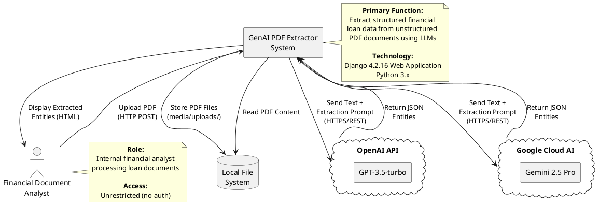
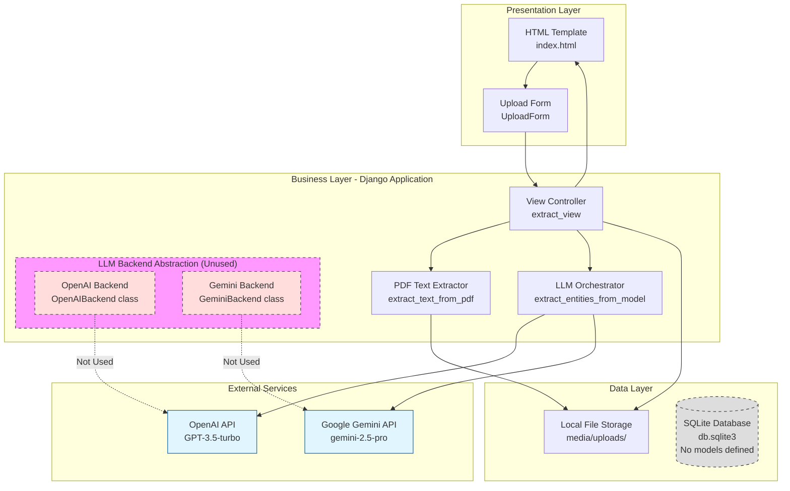
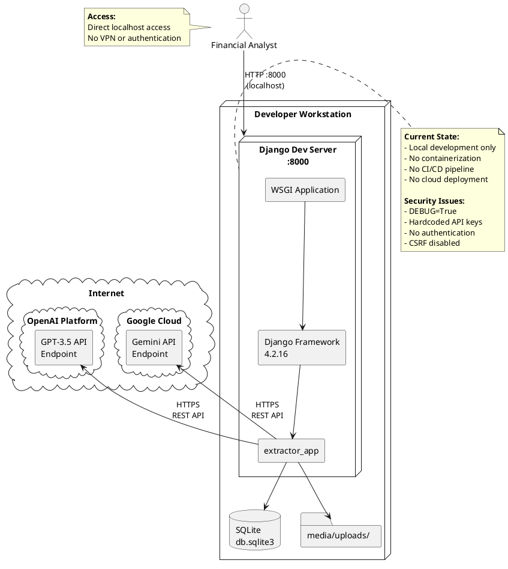
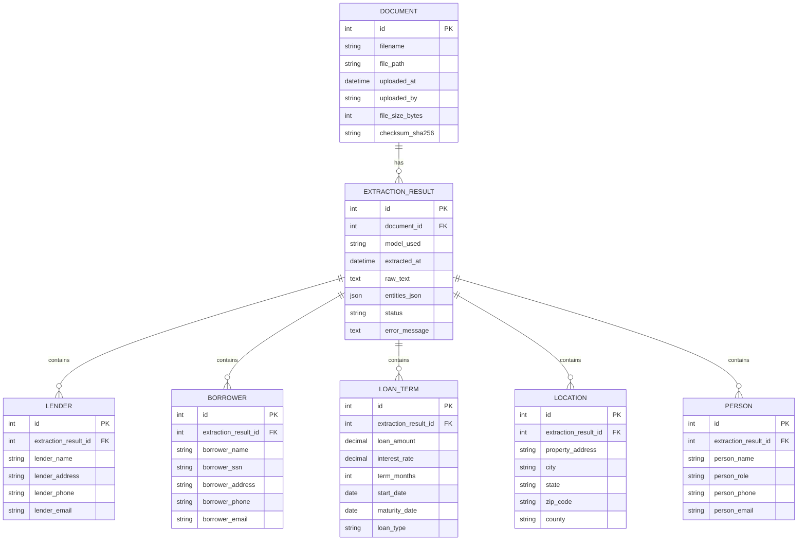
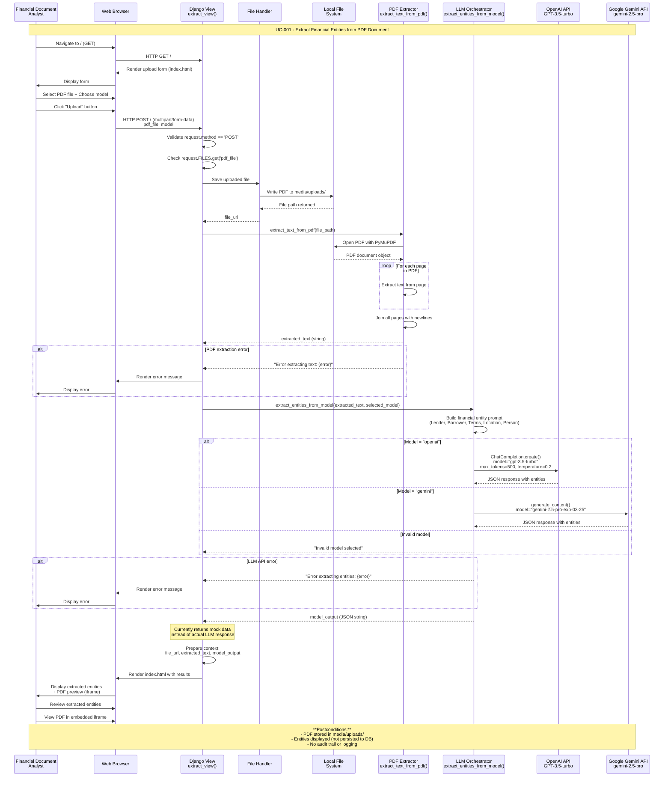

# Design Modelling

## UML Models Overview

This document provides comprehensive UML diagrams and architectural models for the GenAI PDF Extractor system. The diagrams visualize the system architecture, component interactions, data flows, and behavioral patterns based on the codebase analysis documented in `codeanalysis.md`.

**Purpose**: These diagrams serve as visual documentation to understand:
- System boundaries and external integrations
- Component organization and responsibilities
- Deployment architecture and infrastructure
- Data flow and transformation processes
- Dynamic behavior for each use case
- Data model and entity relationships

**Navigation Guide**:
- **Architectural Views**: High-level system structure and deployment
- **Use Case Sequence Diagrams**: Detailed interaction flows for UC-001
- **Logical Data Model**: Entity relationships and database schema

---

## Architectural Views

### System Context Diagram

This diagram shows the GenAI PDF Extractor system boundary, its primary function (financial entity extraction from PDFs), and interactions with external actors and systems.



---

### Component Architecture Diagram

This diagram breaks down the system into individual modules and components, showing their responsibilities and communication paths.



**Component Responsibilities:**

| Component | Responsibility | Technology |
|-----------|---------------|------------|
| HTML Template | Render upload form and display results | Django Templates |
| Upload Form | Handle multipart file upload | Django Forms |
| View Controller | Orchestrate request handling, file saving, extraction | Django Views |
| PDF Text Extractor | Extract raw text from PDF documents | PyMuPDF (fitz) |
| LLM Orchestrator | Route requests to OpenAI or Gemini, handle responses | OpenAI SDK, Google GenAI SDK |
| Local File Storage | Persist uploaded PDF files | Filesystem (media/) |
| SQLite Database | Data persistence (currently unused) | SQLite 3.x |
| LLM Backend Abstraction | Strategy pattern for swappable LLM providers (unused) | Custom Python classes |

---

### Deployment Architecture Diagram

This diagram shows the deployment architecture with a focus on the current local development setup. Note: No cloud infrastructure is currently implemented.



**Deployment Notes:**
- **Current Environment**: Local development only (not production-ready)
- **Server**: Django development server (single-threaded, not suitable for production)
- **Database**: SQLite single-file database (no connection pooling)
- **File Storage**: Local filesystem (no cloud storage integration)
- **Security**: Multiple critical vulnerabilities (see codeanalysis.md Section 10)

**Production Deployment Requirements** (Not Implemented):
- Production WSGI server (Gunicorn/uWSGI)
- Reverse proxy (Nginx/Apache)
- PostgreSQL database with connection pooling
- Cloud storage (S3/GCS) for PDF files
- Container orchestration (Docker/Kubernetes)
- Load balancer with health checks
- Secrets management (AWS Secrets Manager/Azure Key Vault)
- HTTPS with valid SSL certificates

---

### Data Flow Diagram

This diagram illustrates the flow of data through the system, from PDF upload to entity extraction and display.

```plantuml
@startuml Data Flow
!define RECTANGLE class

skinparam defaultTextAlignment center

actor "Financial\nAnalyst" as User
rectangle "Web Browser" as Browser
rectangle "Django Application" as Django {
    process "1. Upload\nHandler" as Upload
    process "2. File\nSaver" as FileSaver
    process "3. PDF Text\nExtractor" as PDFExtract
    process "4. LLM\nOrchestrator" as LLMOrch
    process "5. Response\nRenderer" as Renderer
}

database "File System\nmedia/uploads/" as FileStore
cloud "OpenAI API" as OpenAI
cloud "Gemini API" as Gemini

User --> Browser : Select PDF +\nChoose Model
Browser --> Upload : POST multipart/form-data\n(pdf_file, model)

Upload --> FileSaver : PDF File Object
FileSaver --> FileStore : Write PDF\n(filename.pdf)
FileStore --> FileSaver : File Path

FileSaver --> PDFExtract : File Path
PDFExtract --> FileStore : Read PDF
FileStore --> PDFExtract : PDF Binary
PDFExtract --> PDFExtract : Extract Text\n(PyMuPDF)

PDFExtract --> LLMOrch : Extracted Text +\nModel Selection

alt Model = "openai"
    LLMOrch --> OpenAI : Prompt + Text\n(max_tokens=500)
    OpenAI --> LLMOrch : JSON Entities
else Model = "gemini"
    LLMOrch --> Gemini : Prompt + Text
    Gemini --> LLMOrch : JSON Entities
end

LLMOrch --> Renderer : Entities JSON +\nFile URL +\nExtracted Text

Renderer --> Browser : HTML Response\n(entities + PDF preview)
Browser --> User : Display Results

note right of PDFExtract
  **Data Transformation:**
  PDF Binary → Raw Text
  (page-by-page extraction)
end note

note right of LLMOrch
  **Data Transformation:**
  Raw Text → Structured JSON
  
  **Entities Extracted:**
  - Lender Information
  - Borrower Details
  - Loan Terms
  - Location Data
  - Person Information
end note

note bottom of FileStore
  **Data Persistence:**
  PDFs stored permanently
  No cleanup mechanism
  No database records
end note

@enduml
```

**Data Transformation Pipeline:**

1. **Input**: Multipart form data (PDF file + model selection)
2. **Storage**: PDF saved to `media/uploads/` directory
3. **Extraction**: PyMuPDF extracts text page-by-page
4. **Enrichment**: LLM processes text with financial entity extraction prompt
5. **Output**: JSON entities + PDF preview URL rendered in HTML

**Data Quality Issues:**
- No input validation (file type, size)
- No sanitization of extracted text (prompt injection risk)
- No schema validation of LLM output
- No data persistence (entities not saved to database)

---

### Logical Data Model (ERD)

This ERD represents the **intended** data model for the system. Note: Currently, no Django models are defined, and the database is unused.



**Entity Descriptions:**

| Entity | Purpose | Current Status |
|--------|---------|----------------|
| DOCUMENT | Store metadata about uploaded PDF files | **Not Implemented** |
| EXTRACTION_RESULT | Store LLM extraction results and raw text | **Not Implemented** |
| LENDER | Financial institution providing the loan | **Not Implemented** |
| BORROWER | Individual or entity receiving the loan | **Not Implemented** |
| LOAN_TERM | Loan financial terms and conditions | **Not Implemented** |
| LOCATION | Property location information | **Not Implemented** |
| PERSON | Additional persons involved in the loan | **Not Implemented** |

**Implementation Notes:**
- All entities are currently extracted by LLM but **not persisted** to database
- Django models need to be created in `extractor_app/models.py`
- Database migrations required after model creation
- Consider adding audit fields (created_at, updated_at, created_by)
- Add indexes on foreign keys and frequently queried fields

---

## Use Case Sequence Diagrams

### UC-001: Extract Financial Entities from PDF Document

**Source**: [codeanalysis.md#UC-001](codeanalysis.md#UC-001)

**Description**: Financial Document Analyst uploads a PDF containing loan documentation, selects an LLM model (OpenAI or Gemini), and receives structured financial entity data extracted from the document.



**Sequence Flow Summary:**

1. **Initiation**: Analyst accesses upload form via GET request
2. **Upload**: Analyst submits PDF file with model selection via POST
3. **Validation**: View validates request method and file presence (minimal validation)
4. **Storage**: PDF saved to local filesystem (media/uploads/)
5. **Text Extraction**: PyMuPDF extracts text page-by-page from PDF
6. **LLM Processing**: Text sent to selected LLM (OpenAI or Gemini) with entity extraction prompt
7. **Response**: LLM returns JSON-formatted financial entities
8. **Rendering**: Results displayed alongside PDF preview in browser

**Critical Decision Points:**
- Model selection (OpenAI vs Gemini) determines API routing
- Error handling at PDF extraction and LLM API call stages
- No retry logic or fallback mechanisms

**Error Scenarios:**
- PDF parsing failure → Generic error message returned
- LLM API rate limit/auth error → Generic error message returned
- Invalid model selection → "Invalid model selected" error
- No validation for file type, size, or content

**Security Concerns:**
- No authentication required (CSRF disabled)
- No input validation or sanitization
- Prompt injection vulnerability (user-controlled text in prompt)
- API keys hardcoded in source code
- No rate limiting (DoS risk)

---

## Diagram Summary

| Diagram Type | Purpose | Key Insights |
|--------------|---------|--------------|
| **System Context** | System boundary and external integrations | Shows dependency on OpenAI and Gemini APIs, local file storage, no authentication |
| **Component Architecture** | Module breakdown and responsibilities | Reveals unused LLM backend abstraction, God Object anti-pattern in view, no database usage |
| **Deployment Architecture** | Infrastructure and deployment topology | Highlights local-only deployment, no cloud infrastructure, multiple security vulnerabilities |
| **Data Flow** | Data transformation pipeline | Illustrates synchronous processing bottleneck, no data persistence, no caching |
| **Logical Data Model (ERD)** | Entity relationships and schema | Defines intended data model (not implemented), shows 7 entity types for financial loan data |
| **UC-001 Sequence** | Dynamic behavior for PDF extraction use case | Details request flow, LLM routing logic, error handling gaps, security vulnerabilities |

**Architectural Patterns Identified:**
- **Monolithic Architecture**: Single Django application handles all concerns
- **MVC (MTV)**: Django's Model-Template-View pattern
- **Strategy Pattern (Partial)**: LLM backend abstraction exists but unused
- **Direct API Integration**: Synchronous calls to external LLM APIs

**Anti-Patterns Detected:**
- **God Object**: All logic in single view function
- **Hardcoded Configuration**: API keys in source code
- **Dead Code**: Unused LLM backend classes, duplicate view_old.py
- **Synchronous I/O**: Blocking LLM calls in web request handler
- **No Error Boundaries**: Generic exception catching

---

*This design modelling document provides comprehensive visual representations of the GenAI PDF Extractor system architecture, supporting development, maintenance, and future enhancement efforts.*
