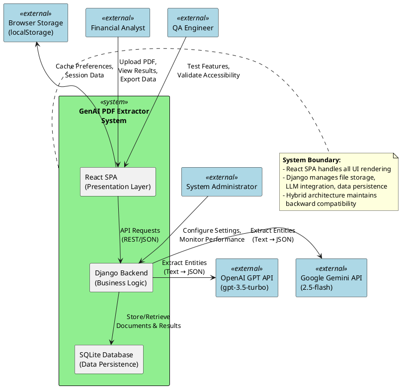
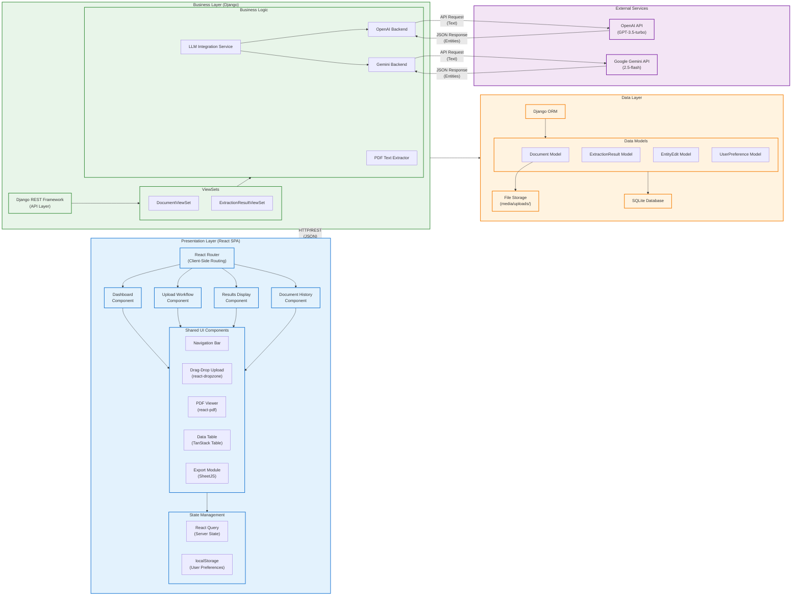
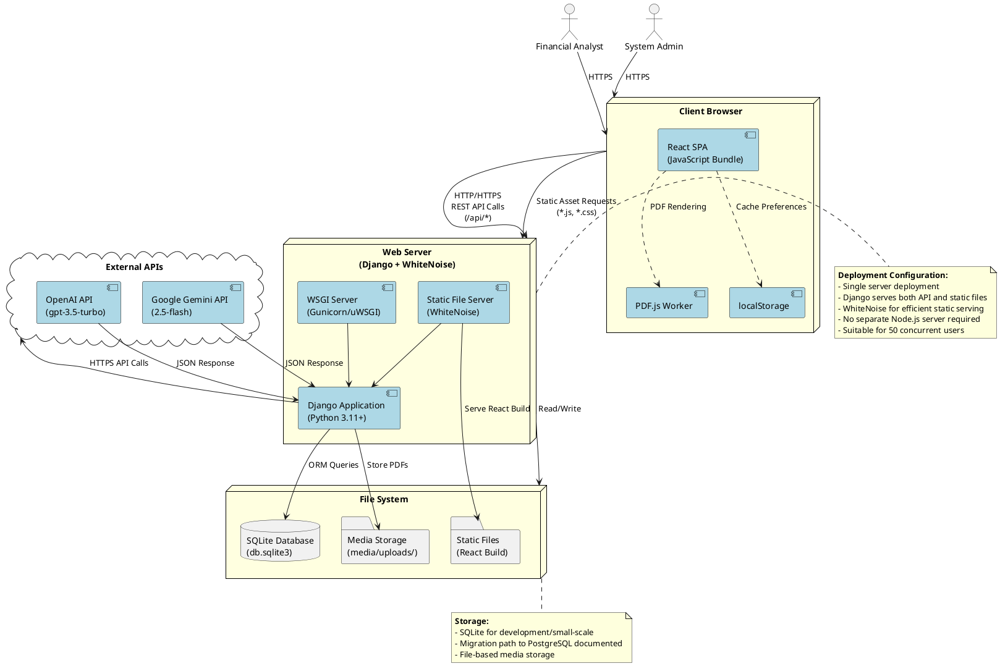
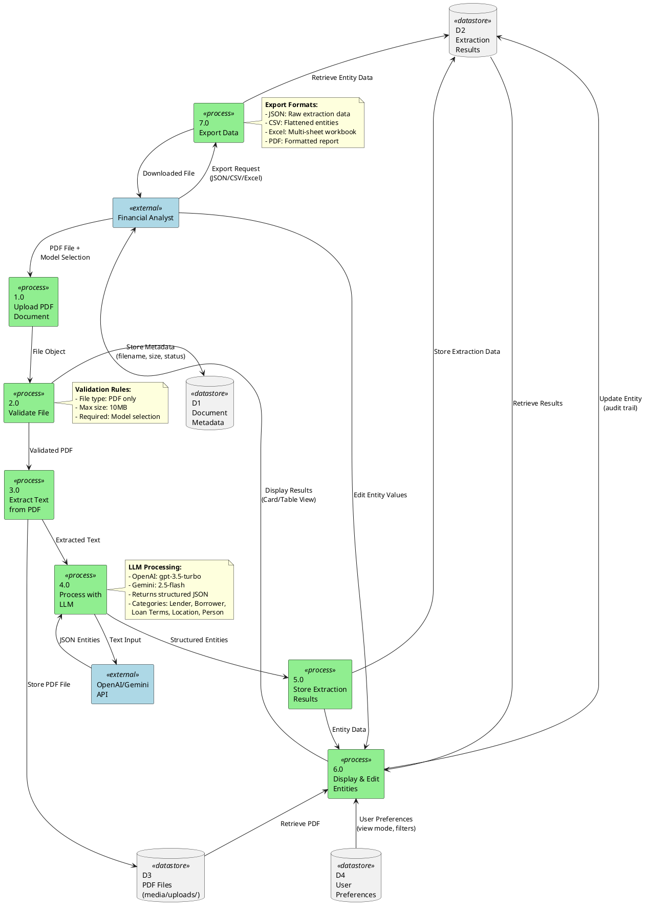
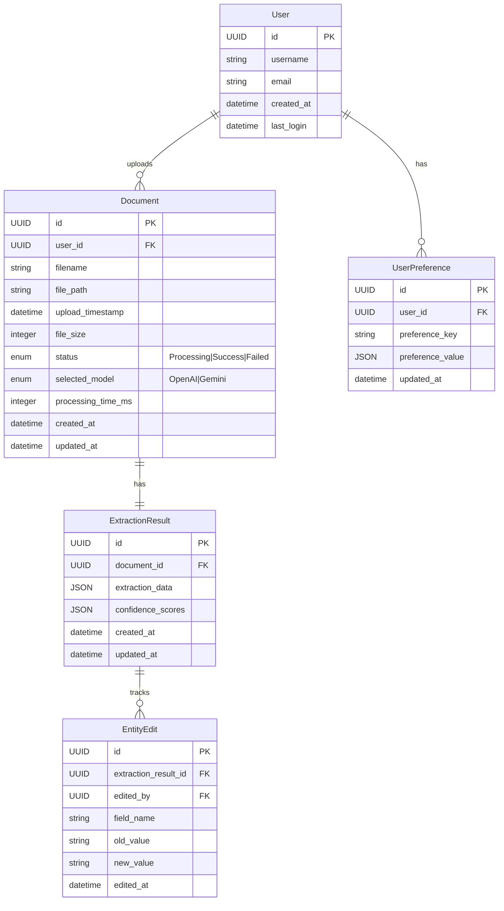
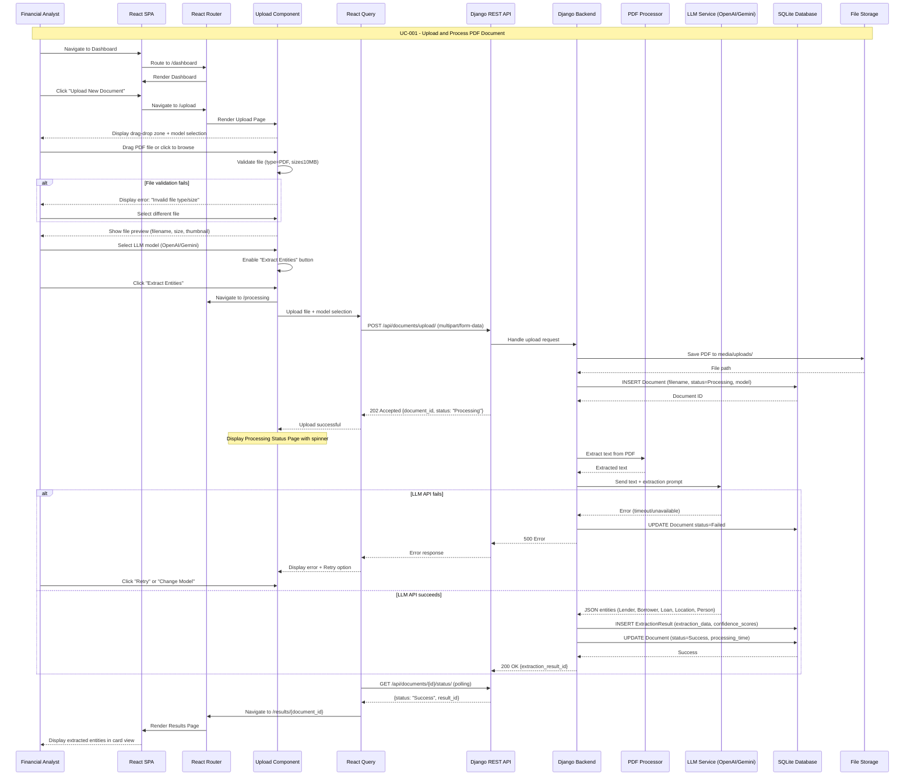
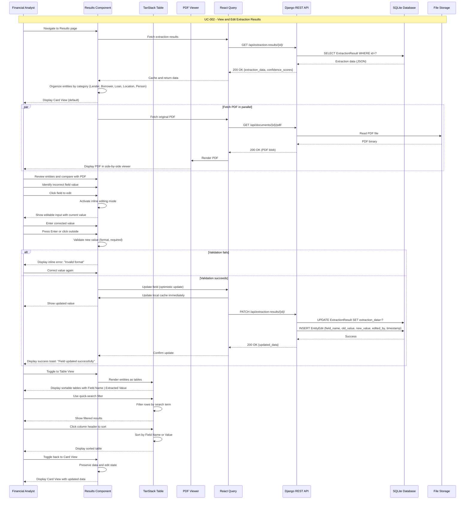
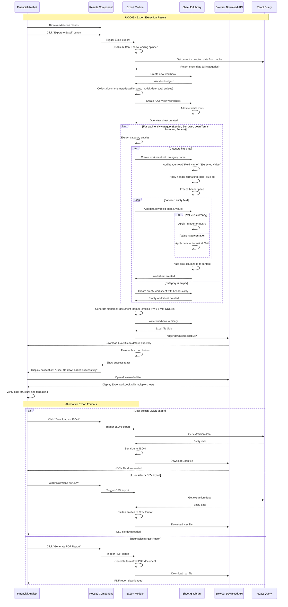
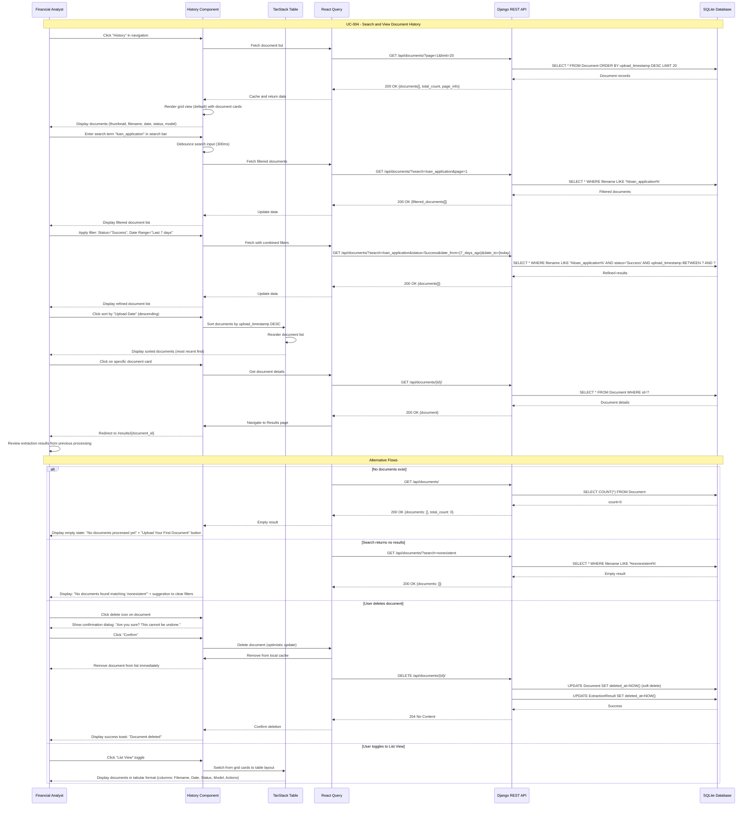

# Design Modelling

## UML Models Overview

This document provides comprehensive visual models representing the GenAI PDF Extractor system architecture and behavior. The diagrams are derived from functional requirements in `spec.md` and architectural decisions in `design.md`. These models serve multiple purposes:

- **System Context Diagram**: Illustrates the system boundary and external interactions with users and LLM services
- **Component Architecture Diagram**: Details the hybrid React + Django architecture with presentation, business, and data layers
- **Deployment Architecture Diagram**: Shows the deployment topology for the web application
- **Data Flow Diagram**: Traces data movement from PDF upload through LLM processing to result display
- **Logical Data Model (ERD)**: Defines database entities and relationships for document management and extraction results
- **Use Case Sequence Diagrams**: Provides detailed interaction flows for each use case (UC-001 through UC-004)

These diagrams align with the modernization goals: transforming a minimal single-page Django application into a professional multi-page React SPA with enhanced UI/UX while maintaining backward compatibility with existing backend infrastructure.

---

## Architectural Views

### System Context Diagram

---

### Component Architecture Diagram

---

### Deployment Architecture Diagram

---

### Data Flow Diagram

---

### Logical Data Model (ERD)

**Entity Descriptions:**

- **User**: Represents authenticated users (financial analysts, admins, QA engineers) with login credentials
- **Document**: Stores metadata for uploaded PDF files including processing status and selected LLM model
- **ExtractionResult**: Contains AI-extracted entity data in JSON format with optional confidence scores
- **EntityEdit**: Audit trail for manual corrections made to extracted entity values
- **UserPreference**: Caches user-specific settings (view mode, filter state, sort order) for session persistence

**Key Relationships:**

- One User uploads many Documents (1:N)
- One Document has exactly one ExtractionResult (1:1)
- One ExtractionResult can have many EntityEdits for audit tracking (1:N)
- One User has many UserPreferences for different settings (1:N)
- EntityEdit references User via edited_by for accountability (N:1)

---

## Use Case Sequence Diagrams

> **Note**: Each sequence diagram details the dynamic message flow and timing for its corresponding use case defined in `spec.md`. These diagrams complement the static use case diagrams in spec.md by showing the temporal sequence of interactions.

### UC-001: Upload and Process PDF Document

**Source**: [spec.md#UC-001](../spec.md#UC-001)

---

### UC-002: View and Edit Extraction Results

**Source**: [spec.md#UC-002](../spec.md#UC-002)

---

### UC-003: Export Extraction Results

**Source**: [spec.md#UC-003](../spec.md#UC-003)

---

### UC-004: Search and View Document History

**Source**: [spec.md#UC-004](../spec.md#UC-004)

---

## Diagram Summary

| Diagram Type | Purpose | Key Insights |
|--------------|---------|--------------|
| **System Context** | Shows system boundary and external actors | Hybrid architecture with React frontend, Django backend, and external LLM APIs (OpenAI/Gemini) |
| **Component Architecture** | Details internal component structure | Clear separation: Presentation (React), Business (Django), Data (SQLite) layers with shared UI components and state management |
| **Deployment** | Illustrates deployment topology | Single-server deployment with Django serving both APIs and static files via WhiteNoise; no separate Node.js server required |
| **Data Flow** | Traces data movement through system | 7-step process: Upload → Validate → Extract Text → LLM Processing → Store → Display/Edit → Export |
| **ERD** | Defines database schema | 5 core entities: User, Document, ExtractionResult, EntityEdit, UserPreference with clear relationships and audit trail |
| **UC-001 Sequence** | Upload and process workflow | Multi-step async flow with validation, LLM integration, error handling, and status polling |
| **UC-002 Sequence** | View and edit results | Parallel PDF loading, inline editing with optimistic updates, view toggling (Card/Table), and real-time validation |
| **UC-003 Sequence** | Export functionality | Client-side Excel generation with SheetJS, multi-sheet workbooks, formatting, and alternative export formats (JSON/CSV/PDF) |
| **UC-004 Sequence** | Document history management | Advanced filtering, search, sorting, pagination, soft delete with confirmation, and empty state handling |

---

## Alignment with Requirements

These models directly support the following requirements from `spec.md` and `design.md`:

**Functional Requirements Coverage:**
- FR-001 to FR-006: Navigation architecture reflected in Component Diagram
- FR-013 to FR-023: Upload workflow detailed in UC-001 Sequence Diagram
- FR-032 to FR-053: Results display and editing shown in UC-002 Sequence Diagram
- FR-054 to FR-068: Export functionality illustrated in UC-003 Sequence Diagram
- FR-069 to FR-078: Document history captured in UC-004 Sequence Diagram

**Non-Functional Requirements Coverage:**
- NFR-011: Backward compatibility maintained through hybrid architecture (System Context, Component Diagrams)
- NFR-001 to NFR-004: Performance optimization through code splitting and lazy loading (Component Diagram)
- NFR-007, NFR-008, NFR-018: Accessibility through shadcn/ui components (Component Diagram)
- NFR-015: Client-side Excel export without server round-trip (UC-003 Sequence Diagram)

**Data Requirements Coverage:**
- DR-001 to DR-015: All data entities, relationships, and storage patterns defined in ERD and Data Flow Diagram
- DR-004: Inline editing with validation shown in UC-002 Sequence Diagram
- DR-005: Audit trail (EntityEdit) modeled in ERD
- DR-011: Multi-format export detailed in UC-003 Sequence Diagram

**Technical Requirements Coverage:**
- TR-001: Hybrid architecture (Django REST + React SPA) shown in all architectural views
- TR-003: React Router with lazy loading illustrated in Component Diagram
- TR-007: React Query for state management depicted in sequence diagrams
- TR-010: SheetJS for Excel export detailed in UC-003 Sequence Diagram
