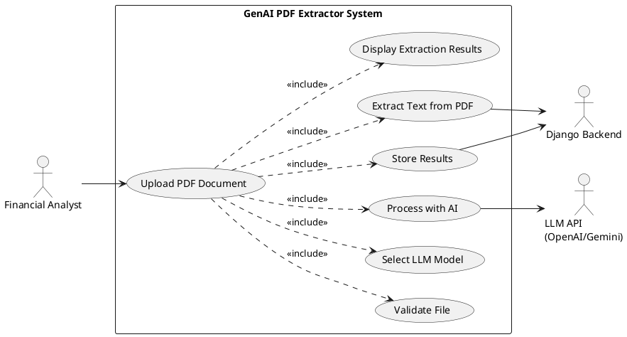
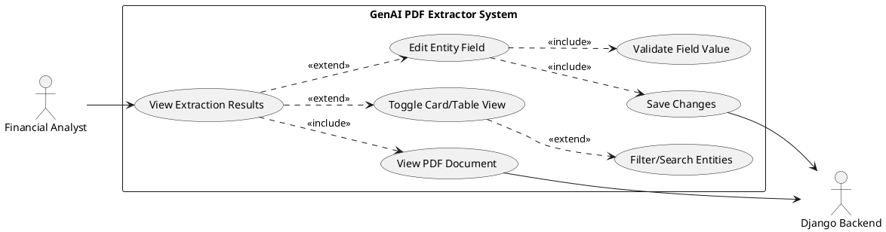
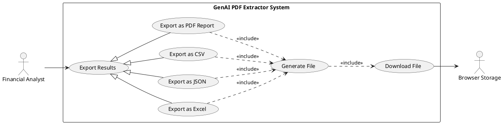
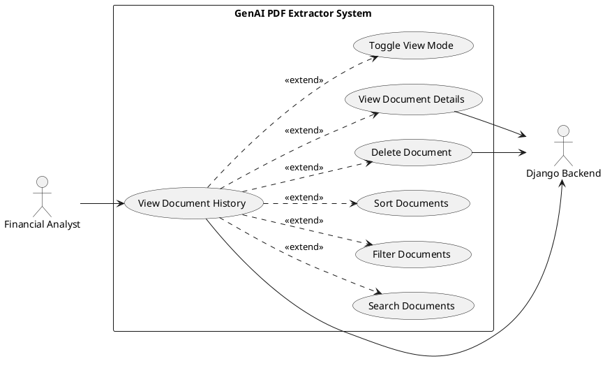
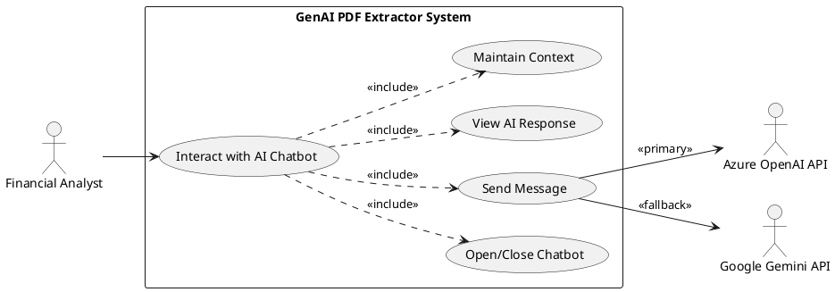

# Requirements Specification
**Project:** GenAI PDF Extractor - UI/UX Modernization  
**Version:** 2.0  
**Date:** March 10, 2026  
**Status:** APPROVED

---

## Feature Goal

Transform the GenAI PDF Extractor application from a minimal single-page interface into a modern, professional, multi-page web application with industry-standard UI/UX design. The enhancement will provide intuitive navigation, responsive layouts, enhanced data visualization, improved user workflows, AI chatbot integration, batch/multi-document processing, and export functionality while maintaining the existing Django backend and LLM integration capabilities.

**Current State:**
- Single-page application with minimal styling and inline CSS
- Basic HTML form with limited user feedback
- Raw JSON output display without structured visualization
- No navigation structure or multi-page workflow
- Non-responsive design
- No accessibility compliance

**Desired State:**
- Modern multi-page application with professional UI design using React + TailwindCSS + shadcn/ui
- Intuitive navigation with dashboard, upload workflow, results display, and document history
- Structured data visualization with card-based and table-based entity display
- Responsive design across desktop, tablet, and mobile devices
- WCAG 2.1 Level AA accessibility compliance
- Enhanced user experience with drag-and-drop upload, real-time progress tracking, and multiple export formats
- AI Chatbot integration on Results page for contextual Q&A about extracted data (powered by Azure OpenAI with Gemini fallback)
- Unified multi-document upload supporting batch processing of loan applications and tax return forms in a single workflow
- Dual-document extraction with separate entity categories for loan documents (Lender, Borrower, Loan Terms, Location, Person) and tax returns (Taxpayer Information, Filing Information, Income Details, Deductions, Tax Calculations, Refund or Amount Due)
- Client-side JSON export with future support for CSV, Excel, and PDF report formats

---

## Business Justification

- **User Productivity Enhancement**: Current interface lacks visual hierarchy and clear workflows, leading to ~5 minutes per document processing time. Target reduction to <3 minutes represents 40% productivity gain for financial analysts processing loan documentation.

- **Professional Image & External Deployment**: Enterprise-grade UI/UX quality is essential for potential external deployment and commercialization opportunities, positioning the application competitively in the financial document processing market.

- **User Adoption & Satisfaction**: Poor UX is a barrier to wider organizational adoption. Target user satisfaction score of ≥8.0/10 and 80% adoption rate within 8 weeks post-launch will drive ROI through increased utilization.

- **Accessibility Compliance**: Meeting WCAG 2.1 AA standards ensures legal compliance, broader user base accessibility, and alignment with enterprise accessibility policies.

- **Integration with Existing Features**: Enhancement maintains full backward compatibility with existing Django backend, OpenAI GPT and Google Gemini LLM integrations, and current data models without requiring database schema changes.

- **Problems Solved**:
  - **For Financial Analysts**: Reduces cognitive load, streamlines document processing workflows, provides clear visual feedback, and enables efficient data verification and export
  - **For Organization**: Improves productivity metrics, reduces training time by 60%, decreases UI-related support tickets by 50%, and enables future commercialization
  - **For Stakeholders**: Demonstrates ROI through measurable productivity gains and positions product for market expansion

---

## Feature Scope

### User-Visible Behavior

**Multi-Page Application Structure:**
1. **Dashboard/Home Page**: Landing page with quick actions, recent document activity, and processing statistics
2. **Document Upload Workflow**: Unified multi-file upload with single drop zone supporting loan applications and tax return forms, LLM model selection, and file list management
3. **Processing Status Page**: Loading spinner during document processing with dual-document detection
4. **Results/Output Display**: Structured entity display with card view, table view, PDF viewer, AI chatbot overlay, and export options
5. **Document History/Library**: Searchable, filterable list of all processed documents with metadata

**Enhanced Data Visualization:**
- Card-based entity display organized by category — for loan documents: Lender, Borrower, Loan Terms, Location, Person; for tax returns: Taxpayer Information, Filing Information, Income Details, Deductions, Tax Calculations, Refund or Amount Due
- Structured table view with sortable columns, filterable rows, and inline editing
- Toggle between card view and table view without data loss
- Side-by-side PDF viewer with zoom and navigation controls
- Dual-document tab navigation when both loan and tax documents are processed
- Nested object rendering with grouped sub-sections (e.g., numbered "Taxpayer 1", "Taxpayer 2" with structured field-value pairs)
- Export functionality: JSON (currently implemented), with planned support for CSV, Excel (.xlsx with multi-sheet workbook), and PDF report

**AI Chatbot Integration:**
- Floating chatbot widget on Results page with FAB (Floating Action Button) toggle
- Contextual Q&A about extracted document data using Azure OpenAI (with Gemini fallback)
- Dual-document awareness — chatbot includes both loan and tax extraction context when available
- Markdown rendering of chatbot responses with ReactMarkdown
- Conversation history management (last 10 messages retained)
- Multiline input support (Shift+Enter) with auto-focus

**Batch/Multi-Document Upload:**
- Single unified drop zone replacing dual upload sections
- Support for up to 10 files per upload session
- File type validation (PDF only), size validation (10MB per file), and duplicate detection
- File list with individual remove capability
- Automatic mapping: first file as loan document, second file as tax return for backend compatibility

**User Experience Improvements:**
- Drag-and-drop file upload with visual feedback
- Inline validation and contextual error messaging
- Toast notifications for success/error states
- Keyboard shortcuts and accessibility features
- Empty states with helpful guidance
- Loading states for all asynchronous operations

**Responsive Design:**
- Desktop layout (≥1024px): Multi-column layouts, side-by-side views
- Tablet layout (768px-1023px): Adaptive layouts, collapsible sections
- Mobile layout (<768px): Single-column, stacked layouts, touch-optimized controls

### Technical Requirements

**Frontend Technology Stack:**
- React 18+ with TypeScript for type safety
- Vite for fast development and build tooling
- TailwindCSS for utility-first styling
- shadcn/ui for accessible, pre-built components
- Lucide React for consistent iconography
- React Query (TanStack Query) for server state management
- React Hook Form + Zod for form handling and validation
- react-pdf or PDF.js for PDF rendering
- react-dropzone for drag-and-drop functionality
- Framer Motion for animations and transitions
- TanStack Table (React Table v8) for data tables
- SheetJS (xlsx) for client-side Excel export

**Backend Integration:**
- Django REST Framework for API endpoints
- React SPA consumes Django APIs
- Django handles authentication, file storage, LLM integration
- Hybrid architecture with Django serving APIs and React handling UI

**Performance Requirements:**
- Initial page load < 3 seconds on 3G connection
- Time to Interactive (TTI) < 5 seconds
- First Contentful Paint (FCP) < 2 seconds
- Cumulative Layout Shift (CLS) < 0.1
- Page transitions < 300ms

**Accessibility Requirements:**
- WCAG 2.1 Level AA compliance
- Keyboard navigation for all interactive elements
- Screen reader compatibility with proper ARIA labels
- Color contrast ratios ≥ 4.5:1 for normal text, ≥ 3:1 for large text
- Focus indicators on all focusable elements

### Success Criteria

- [x] All pages follow defined design system (colors, typography, spacing)
- [x] Responsive layouts work correctly on desktop (1920px), tablet (768px), mobile (375px)
- [x] File upload supports drag-and-drop and click-to-browse with unified multi-file drop zone
- [x] Upload supports batch processing of multiple documents (up to 10 files)
- [x] Results page displays extracted entities in both card view and table view
- [x] Table view supports sorting, filtering, inline editing, and sticky headers
- [x] PDF viewer allows zoom, page navigation, and full-screen mode
- [x] Dual-document results display with tab navigation for loan and tax documents
- [x] Nested objects render as grouped sub-sections with numbered labels (e.g., Taxpayer 1, Taxpayer 2)
- [x] AI Chatbot accessible on Results page with contextual Q&A capability
- [x] Chatbot supports dual-document context when both loan and tax documents are processed
- [x] Export functionality works for JSON format (client-side download)
- [x] Excel export generates multi-sheet workbook with formatted headers and auto-sized columns (planned)
- [x] Document history displays all processed documents with search and filter
- [x] All pages pass WCAG 2.1 Level AA automated accessibility tests
- [x] Page load time < 3 seconds, TTI < 5 seconds, FCP < 2 seconds
- [x] Application works correctly in Chrome, Firefox, Safari, Edge (latest 2 versions)

---

## Functional Requirements

### Navigation & Information Architecture

- FR-001: [DETERMINISTIC] System MUST provide a fixed top navigation bar on all pages containing application logo, main menu items (Dashboard, Upload, History), and user profile/settings icon
- FR-002: [DETERMINISTIC] System MUST highlight the active page in the navigation menu with visual indicator (color change, underline, or background)
- FR-003: [DETERMINISTIC] System MUST display breadcrumb navigation below top navigation showing current page hierarchy (e.g., "Home > Upload Document > Processing")
- FR-004: [DETERMINISTIC] System MUST implement responsive mobile navigation with hamburger menu icon for screen widths < 768px
- FR-005: [DETERMINISTIC] System MUST allow users to navigate to any major section within 2 clicks from any page
- FR-006: [DETERMINISTIC] System MUST support deep linking to allow bookmarking of specific pages (Dashboard, Upload, Results, History)

### Dashboard/Home Page

- FR-007: [DETERMINISTIC] System MUST display a dashboard landing page with welcome message and user context
- FR-008: [DETERMINISTIC] System MUST provide a prominent "Upload New Document" call-to-action button on the dashboard
- FR-009: [DETERMINISTIC] System MUST display recent extractions (last 5-10 documents) with thumbnails, filenames, upload dates, and status badges
- FR-010: [DETERMINISTIC] System MUST show quick statistics including total documents processed, success rate percentage, and recent activity count
- FR-011: [DETERMINISTIC] System MUST organize dashboard content in 3-column grid layout on desktop (≥1024px) and stacked layout on mobile (<768px)
- FR-012: [DETERMINISTIC] System MUST provide quick action links to Upload, History, and Settings from the dashboard

### Document Upload Workflow

- FR-013: [DETERMINISTIC] System MUST provide a single unified drop zone for uploading multiple PDF documents (loan applications and tax return forms) without separate section headings
- FR-014: [DETERMINISTIC] System MUST allow users to click the upload area to browse and select one or more PDF files from their file system
- FR-015: [DETERMINISTIC] System MUST validate each uploaded file for type (PDF only) and size (maximum 10MB per file) with immediate feedback
- FR-016: [DETERMINISTIC] System MUST display clear error messages for invalid files (e.g., "File type not supported. Please upload a PDF file" or "File size exceeds 10MB limit")
- FR-017: [DETERMINISTIC] System MUST display a file list below the drop zone showing each uploaded file with filename, file size, and a remove button
- FR-018: [DETERMINISTIC] System MUST provide LLM model selection with radio buttons or card selection UI showing model descriptions (OpenAI: "Fast and accurate for standard documents", Gemini: "Advanced processing for complex layouts")
- FR-019: [DETERMINISTIC] System MUST support uploading up to 10 files per session with duplicate file detection based on filename
- FR-020: [DETERMINISTIC] System MUST provide individual file removal from the upload list via a remove/delete icon per file
- FR-021: [DETERMINISTIC] System MUST disable "Extract Entities" button until at least one valid file is selected and a model is chosen
- FR-022: [DETERMINISTIC] System MUST redirect to processing status page after successful upload and extraction initiation
- FR-023: [DETERMINISTIC] System MUST automatically map the first uploaded file as the loan document and the second uploaded file as the tax return form for dual-document processing on the backend

### Processing Status Page

- FR-024: [DETERMINISTIC] System MUST display loading spinner during document processing
- FR-025: [DETERMINISTIC] System MUST automatically redirect to results page upon successful completion
- FR-026: [DETERMINISTIC] System MUST provide error handling with clear error messages and "Retry" option if processing fails

### Results/Output Display Page

- FR-032: [DETERMINISTIC] System MUST display extracted entities organized by category — for loan documents: Lender Information, Borrower Details, Loan Terms, Location Data, Person Information; for tax return documents: Taxpayer Information, Filing Information, Income Details, Deductions, Tax Calculations, Refund or Amount Due
- FR-033: [DETERMINISTIC] System MUST provide card-based layout as default view with each entity category in a separate card component
- FR-034: [DETERMINISTIC] System MUST display each entity field with clear label and extracted value within cards
- FR-035: [DETERMINISTIC] System MUST show confidence scores for each extracted field if available from LLM response
- FR-036: [DETERMINISTIC] System MUST provide toggle switch to alternate between "Card View" and "Table View" without data loss
- FR-037: [DETERMINISTIC] System MUST render each entity category as a dedicated sortable table in Table View mode
- FR-038: [DETERMINISTIC] System MUST display table columns as "Field Name" and "Extracted Value" with clear header rows
- FR-039: [DETERMINISTIC] System MUST support nested JSON objects by flattening them into dot-notation field names or expandable sub-rows in tables
- FR-040: [DETERMINISTIC] System MUST provide sortable table columns (click header to sort by field name or value)
- FR-041: [DETERMINISTIC] System MUST implement quick-search filter input above each table to filter rows by field name or value
- FR-042: [DETERMINISTIC] System MUST support inline editing of entity values with click-to-edit pattern in both card and table views
- FR-043: [DETERMINISTIC] System MUST display visual placeholder (e.g., "--" with muted styling) for empty or null fields
- FR-044: [DETERMINISTIC] System MUST implement responsive tables with horizontal scrolling on mobile and full-width on desktop
- FR-045: [DETERMINISTIC] System MUST apply row striping (alternating background colors) for improved table readability
- FR-046: [DETERMINISTIC] System MUST keep table headers sticky when scrolling through long entity lists
- FR-047: [DETERMINISTIC] System MUST provide "Copy Row" action to copy field label and value to clipboard
- FR-048: [DETERMINISTIC] System MUST use accessible table markup with proper `<thead>`, `<tbody>`, `<th scope>` attributes and ARIA labels
- FR-049: [DETERMINISTIC] System MUST display original PDF in side-by-side view (desktop) or tabbed interface (mobile/tablet)
- FR-050: [DETERMINISTIC] System MUST provide PDF viewer with zoom controls, page navigation, and full-screen option
- FR-051: [DETERMINISTIC] System MUST show extraction metadata including filename, upload date, model used, and processing time
- FR-052: [DETERMINISTIC] System MUST provide "Process Another Document" quick action button to return to upload page
- FR-053: [DETERMINISTIC] System MUST implement document information header with action buttons: Edit, Export, Delete

### Export Functionality

- FR-054: [DETERMINISTIC] System MUST provide "Download as JSON" button to export raw extraction results in JSON format
- FR-055: [DETERMINISTIC] System MUST provide "Download as CSV" button to export flattened entity data in CSV format
- FR-056: [DETERMINISTIC] System MUST provide "Download as Excel" button with spreadsheet icon to export formatted .xlsx file
- FR-057: [DETERMINISTIC] System MUST generate Excel file client-side using SheetJS library without requiring server round-trip
- FR-058: [DETERMINISTIC] System MUST create one worksheet per entity category in Excel file (sheets named: "Lender", "Borrower", "Loan Terms", "Location", "Person")
- FR-059: [DETERMINISTIC] System MUST include header row in each worksheet with column names "Field Name" and "Extracted Value" styled with bold font, background color (#3B82F6), white text, and frozen pane
- FR-060: [DETERMINISTIC] System MUST auto-size data columns to fit content width in Excel worksheets
- FR-061: [DETERMINISTIC] System MUST include "Overview" summary worksheet as first sheet listing document metadata (filename, model used, processing date, total entities extracted)
- FR-062: [DETERMINISTIC] System MUST format currency values in Excel with number format `$#,##0.00` and percentages with `0.00%` format
- FR-063: [DETERMINISTIC] System MUST name exported Excel file using pattern `{document_name}_entities_{YYYY-MM-DD}.xlsx`
- FR-064: [DETERMINISTIC] System MUST show brief loading spinner on export button during file generation
- FR-065: [DETERMINISTIC] System MUST display success toast notification upon successful export completion
- FR-066: [DETERMINISTIC] System MUST handle edge cases: empty categories produce empty sheet with headers only, special characters in field values are properly escaped
- FR-067: [DETERMINISTIC] System MUST make export button keyboard accessible with ARIA label "Export extraction results to Excel spreadsheet"
- FR-068: [DETERMINISTIC] System MUST provide "Generate PDF Report" button to create formatted PDF document with extraction results

### Document History/Library

- FR-069: [DETERMINISTIC] System MUST display list/grid view of all previously processed documents
- FR-070: [DETERMINISTIC] System MUST show document thumbnail, filename, upload date, processing status, and model used for each document
- FR-071: [DETERMINISTIC] System MUST provide view toggle to switch between grid view (cards) and list view (table)
- FR-072: [DETERMINISTIC] System MUST implement search functionality to filter documents by filename
- FR-073: [DETERMINISTIC] System MUST provide filter dropdown to filter by date range, status (Success, Failed, Processing), and model used (OpenAI, Gemini)
- FR-074: [DETERMINISTIC] System MUST support sorting by upload date, filename, and status (ascending/descending)
- FR-075: [DETERMINISTIC] System MUST allow users to click on a document to view its extraction results (redirect to Results page)
- FR-076: [DETERMINISTIC] System MUST provide delete functionality with confirmation dialog for destructive actions
- FR-077: [DETERMINISTIC] System MUST implement pagination with page numbers, Previous/Next buttons, and items-per-page selector for large document sets
- FR-078: [DETERMINISTIC] System MUST display empty state with helpful guidance when no documents have been processed

### AI Chatbot Integration

- FR-117: [DETERMINISTIC] System MUST provide a floating chatbot widget on the Results page, toggled via a Floating Action Button (FAB) positioned at the bottom-right corner
- FR-118: [DETERMINISTIC] System MUST display the chatbot in a 380×520px overlay window with header, scrollable message area, and input field
- FR-119: [DETERMINISTIC] System MUST send user messages to the `/api/chat/` backend endpoint along with extraction context (extracted entities and document data)
- FR-120: [DETERMINISTIC] System MUST use Azure OpenAI as the primary LLM for chatbot responses, with Google Gemini (gemini-2.5-flash) as automatic fallback
- FR-121: [DETERMINISTIC] System MUST render chatbot responses in Markdown format using ReactMarkdown
- FR-122: [DETERMINISTIC] System MUST maintain conversation history (last 10 messages) for context continuity within a session
- FR-123: [DETERMINISTIC] System MUST support multiline input via Shift+Enter key combination and send on Enter
- FR-124: [DETERMINISTIC] System MUST display "Dual Document Assistant" title when both loan and tax documents are present, and "Document Assistant" for single-document results
- FR-125: [DETERMINISTIC] System MUST include both loan document and tax return extraction data in chatbot context when dual-document results are available
- FR-126: [DETERMINISTIC] System MUST show a typing indicator while waiting for chatbot API responses

### Dual-Document / Batch Processing

- FR-127: [DETERMINISTIC] System MUST support dual-document processing where a loan application and tax return form are uploaded and processed together
- FR-128: [DETERMINISTIC] System MUST provide document tab navigation on the Results page when dual-document results are available (e.g., "Loan Application" and "Tax Return Form" tabs)
- FR-129: [DETERMINISTIC] System MUST render tax return entity data with numbered taxpayer labels (e.g., "Taxpayer 1", "Taxpayer 2") instead of using taxpayer names as section titles
- FR-130: [DETERMINISTIC] System MUST render nested entity objects as grouped sub-sections with a section title and structured field-value pairs rather than flattened inline text
- FR-131: [DETERMINISTIC] System MUST send dual-document uploads to the backend as `loan_file` and `tax_file` FormData fields for the `/api/extract/` endpoint
- FR-132: [DETERMINISTIC] System MUST detect dual-document upload on the Processing page and display appropriate progress messaging for multi-document extraction

### Visual Design & UI Components

- FR-079: [DETERMINISTIC] System MUST implement design system with consistent color palette: Primary Blue (#3B82F6), Secondary Indigo (#6366F1), Success Green (#10B981), Warning Amber (#F59E0B), Error Red (#EF4444), Neutral Gray scale (#F9FAFB to #111827)
- FR-080: [DETERMINISTIC] System MUST ensure all color combinations meet WCAG 2.1 AA contrast ratio requirements (4.5:1 for normal text, 3:1 for large text)
- FR-081: [DETERMINISTIC] System MUST use Inter font family for primary text and Fira Code for monospace/JSON display
- FR-082: [DETERMINISTIC] System MUST implement typography hierarchy with defined type scale: H1 (36px/700), H2 (30px/600), H3 (24px/600), H4 (20px/600), Body (16px/400), Small (14px/400), Caption (12px/400)
- FR-083: [DETERMINISTIC] System MUST use consistent spacing system based on 4px/8px grid: 0, 4px, 8px, 12px, 16px, 24px, 32px, 48px, 64px, 96px
- FR-084: [DETERMINISTIC] System MUST apply elevation shadows at four levels: Level 1 (cards/inputs), Level 2 (dropdowns/popovers), Level 3 (modals/dialogs), Level 4 (sticky headers)
- FR-085: [DETERMINISTIC] System MUST implement reusable component library including: Buttons (primary, secondary, tertiary, danger), Form inputs (text, file upload, select, checkbox, radio), Cards, Tables, Modals/Dialogs, Toast notifications, Loading indicators, Navigation components, Icons
- FR-086: [DETERMINISTIC] System MUST set maximum content width to 1280px (centered) with responsive padding: 16px (mobile), 24px (tablet), 32px (desktop)

### Interaction Design & Micro-interactions

- FR-087: [DETERMINISTIC] System MUST implement button hover effect with scale 1.02 and 150ms transition
- FR-088: [DETERMINISTIC] System MUST apply card hover effect with shadow lift and 200ms transition
- FR-089: [DETERMINISTIC] System MUST use fade-in page transitions with 300ms duration
- FR-090: [DETERMINISTIC] System MUST display skeleton screens or spinners for loading states matching final content layout
- FR-091: [DETERMINISTIC] System MUST show toast notifications that slide in from top-right and auto-dismiss after 5 seconds
- FR-092: [DETERMINISTIC] System MUST apply shake animation for form validation errors
- FR-093: [DETERMINISTIC] System MUST provide loading spinner inside buttons with disabled state during async operations
- FR-094: [DETERMINISTIC] System MUST display empty states with illustrative icon, clear heading, descriptive text, and primary action button

### Error Handling & User Feedback

- FR-095: [DETERMINISTIC] System MUST display inline validation errors for form inputs with red border and error message below field
- FR-096: [DETERMINISTIC] System MUST show toast notifications for success actions (green background, checkmark icon) and error actions (red background, error icon)
- FR-097: [DETERMINISTIC] System MUST provide detailed error messages with suggested corrective actions (e.g., "Upload failed. Please check your internet connection and try again.")
- FR-098: [DETERMINISTIC] System MUST implement empty states for all data views with helpful guidance text
- FR-099: [DETERMINISTIC] System MUST show loading states for all asynchronous operations (file upload, PDF processing, data fetching)
- FR-100: [DETERMINISTIC] System MUST provide confirmation dialogs for destructive actions (delete document) with "Cancel" and "Confirm" options

### Accessibility Requirements

- FR-101: [DETERMINISTIC] System MUST make all interactive elements keyboard accessible with Tab, Enter, and Esc key support
- FR-102: [DETERMINISTIC] System MUST display visible focus indicators on all focusable elements with 2px outline
- FR-103: [DETERMINISTIC] System MUST provide ARIA labels for icon-only buttons (e.g., aria-label="Upload document")
- FR-104: [DETERMINISTIC] System MUST use semantic HTML structure with proper heading hierarchy, landmarks (header, nav, main, footer), and lists
- FR-105: [DETERMINISTIC] System MUST include alt text for all images and decorative icons (alt="" for decorative)
- FR-106: [DETERMINISTIC] System MUST not use color as sole indicator of information (combine with icons, text, or patterns)
- FR-107: [DETERMINISTIC] System MUST properly associate form labels with inputs using `<label for="">` or aria-labelledby
- FR-108: [DETERMINISTIC] System MUST announce error messages to screen readers using aria-live regions
- FR-109: [DETERMINISTIC] System MUST provide skip navigation link for keyboard users to bypass repetitive content
- FR-110: [DETERMINISTIC] System MUST ensure minimum touch target size of 44x44px for all interactive elements on mobile

### Responsive Design Requirements

- FR-111: [DETERMINISTIC] System MUST implement desktop layout (≥1024px) with multi-column layouts and side-by-side views
- FR-112: [DETERMINISTIC] System MUST implement tablet layout (768px-1023px) with adaptive layouts and collapsible sections
- FR-113: [DETERMINISTIC] System MUST implement mobile layout (<768px) with single-column stacked layouts and touch-optimized controls
- FR-114: [DETERMINISTIC] System MUST scale images and PDFs appropriately for different screen sizes
- FR-115: [DETERMINISTIC] System MUST adapt navigation to screen size (hamburger menu on mobile, full menu on desktop)
- FR-116: [DETERMINISTIC] System MUST ensure all text remains readable without horizontal scrolling on mobile devices

---

## Use Case Analysis

### Actors & System Boundary

**Primary Actors:**
- **Financial Analyst**: Internal user who processes loan documentation and extracts entity data from PDF files. Responsible for uploading documents, selecting appropriate LLM models, reviewing extraction results, making manual corrections, and exporting data for downstream analysis.

**Secondary Actors:**
- **System Administrator**: Manages application configuration, monitors system performance, and handles user access. Interacts with system settings and configuration interfaces.
- **QA Engineer**: Tests application functionality, validates accessibility compliance, and verifies extraction accuracy. Uses all application features for comprehensive testing.

**System Actors:**
- **OpenAI GPT API**: External LLM service that processes PDF text and extracts structured entity data. Receives text input and returns JSON-formatted extraction results.
- **Google Gemini API**: External LLM service providing advanced document processing capabilities. Alternative to OpenAI for complex document layouts.
- **Django Backend**: Server-side system managing file storage, API endpoints, LLM integration, and data persistence. Handles authentication, request routing, and business logic.
- **Browser Storage**: Client-side storage system for caching user preferences, session data, and temporary file previews.

### Use Case Specifications

#### UC-001: Upload and Process PDF Document(s)

- **Actor(s)**: Financial Analyst (Primary), OpenAI/Gemini API (System), Django Backend (System)
- **Goal**: Upload one or more PDF documents (loan application and/or tax return form), select an LLM model, and extract structured entity data
- **Preconditions**: 
  - User is authenticated and has access to the application
  - User has valid PDF document(s) (≤10MB each) containing financial entity data
  - At least one LLM service (OpenAI or Gemini) is available and configured
- **Success Scenario**:
  1. Financial Analyst navigates to Dashboard and clicks "Upload New Document" button
  2. System displays Upload Document page with a single unified drop zone and model selection
  3. Financial Analyst drags one or more PDF files into the unified drop zone, or clicks to browse and select files
  4. System validates each file for type (PDF) and size (≤10MB), checks for duplicates, and displays a file list with filenames, sizes, and remove buttons
  5. Financial Analyst selects LLM model (OpenAI GPT or Gemini) via radio button selection
  6. Financial Analyst clicks "Extract Entities" button
  7. System maps the first file as loan_file and the second file as tax_file, uploads to Django Backend via `/api/extract/`, and displays Processing Status page with loading spinner
  8. Django Backend extracts text from each PDF and sends to selected LLM API with document-specific prompts
  9. LLM API processes text and returns structured JSON with extracted entities for each document type
  10. System stores extraction results and redirects to Results page with dual-document tab navigation (if two documents were uploaded)
  11. Financial Analyst reviews extracted entities organized by category in card view, switching between document tabs as needed
- **Extensions/Alternatives**:
  - 4a. File validation fails (invalid type, size exceeds 10MB, or duplicate filename):
    - 4a1. System displays error message: "File type not supported. Please upload a PDF file", "File size exceeds 10MB limit", or "File already added"
    - 4a2. Invalid file is rejected; existing valid files remain in the list
    - 4a3. Use case returns to step 3
  - 9a. LLM API request fails (timeout, service unavailable, API key invalid):
    - 9a1. System displays error message: "Processing failed. Please try again or select a different model"
    - 9a2. System provides "Retry" button and "Change Model" option
    - 9a3. If user clicks "Retry", use case returns to step 7
    - 9a4. If user clicks "Change Model", use case returns to step 5
  - 3a. User uploads only one file:
    - 3a1. System processes as single-document extraction (loan document only)
    - 3a2. Results page shows single-document view without tab navigation
  - 4b. User removes a file from the list:
    - 4b1. System removes the file from the upload list
    - 4b2. Use case continues from current step
- **Postconditions**: 
  - PDF document(s) stored in media/uploads/ directory
  - Extraction results are persisted in database with metadata (filename, model used, timestamp, status)
  - User can view extraction results on Results page with dual-document tab navigation if applicable
  - Document appears in Document History with "Success" status

##### Use Case Diagram

#### UC-002: View and Edit Extraction Results

- **Actor(s)**: Financial Analyst (Primary), Django Backend (System)
- **Goal**: Review extracted entity data, make manual corrections to inaccurate fields, and verify data quality
- **Preconditions**:
  - Document has been successfully processed and extraction results are available
  - User has navigated to Results page for a specific document
- **Success Scenario**:
  1. Financial Analyst views Results page displaying extracted entities in card view by default
  2. System organizes entities by category: Lender, Borrower, Loan Terms, Location, Person
  3. Financial Analyst reviews each entity field and compares with original PDF in side-by-side viewer
  4. Financial Analyst identifies an incorrect field value (e.g., wrong loan amount)
  5. Financial Analyst clicks on the field value to activate inline editing mode
  6. System displays editable text input with current value pre-filled
  7. Financial Analyst corrects the value and presses Enter or clicks outside field to save
  8. System validates the new value and updates the entity data
  9. System displays success toast notification: "Field updated successfully"
  10. Financial Analyst continues reviewing and correcting other fields as needed
  11. Financial Analyst toggles to Table View to see all entities in sortable table format
  12. System renders each entity category as a dedicated table with Field Name and Extracted Value columns
  13. Financial Analyst uses quick-search filter to find specific fields
  14. Financial Analyst completes review and proceeds to export data
- **Extensions/Alternatives**:
  - 8a. Validation fails (invalid format for currency, date, or required field):
    - 8a1. System displays inline error message: "Invalid format. Please enter a valid [field type]"
    - 8a2. System keeps field in edit mode with error styling (red border)
    - 8a3. Use case returns to step 7
  - 11a. User switches between Card View and Table View:
    - 11a1. System preserves all data and edit state during view toggle
    - 11a2. System maintains scroll position and filter state
    - 11a3. Use case continues from current step
  - 3a. Original PDF fails to load in viewer:
    - 3a1. System displays error message: "PDF preview unavailable. Download file to view."
    - 3a2. System provides "Download PDF" button
    - 3a3. Use case continues without PDF viewer
- **Postconditions**:
  - Corrected entity values are persisted in database
  - Audit trail records user edits with timestamp and field changes
  - Updated data is reflected in all views (card view, table view, export)

##### Use Case Diagram

#### UC-003: Export Extraction Results

- **Actor(s)**: Financial Analyst (Primary), Browser Storage (System)
- **Goal**: Export extracted entity data in desired format (JSON, CSV, Excel, or PDF) for downstream analysis or reporting
- **Preconditions**:
  - Extraction results are available and displayed on Results page
  - User has reviewed and optionally edited entity data
- **Success Scenario**:
  1. Financial Analyst clicks "Export to Excel" button on Results page
  2. System displays loading spinner on button and disables it temporarily
  3. System collects all entity data from current extraction results
  4. System generates Excel workbook using SheetJS library client-side
  5. System creates "Overview" worksheet with document metadata (filename, model, date, total entities)
  6. System creates separate worksheets for each entity category: Lender, Borrower, Loan Terms, Location, Person
  7. System formats worksheet headers with bold font, blue background (#3B82F6), white text, and frozen pane
  8. System auto-sizes columns to fit content width
  9. System applies number formatting: currency as `$#,##0.00`, percentages as `0.00%`
  10. System generates filename using pattern: `{document_name}_entities_{YYYY-MM-DD}.xlsx`
  11. System triggers browser download of Excel file
  12. System displays success toast notification: "Excel file downloaded successfully"
  13. Financial Analyst opens downloaded file and verifies data structure and formatting
- **Extensions/Alternatives**:
  - 1a. User selects JSON export:
    - 1a1. System serializes entity data to JSON format
    - 1a2. System triggers download of .json file
    - 1a3. Use case ends
  - 1b. User selects CSV export:
    - 1b1. System flattens entity data to CSV format with headers
    - 1b2. System triggers download of .csv file
    - 1b3. Use case ends
  - 1c. User selects PDF Report export:
    - 1c1. System generates formatted PDF document with entity data and original document reference
    - 1c2. System triggers download of .pdf file
    - 1c3. Use case ends
  - 4a. Excel generation fails (browser compatibility, memory limit):
    - 4a1. System displays error toast: "Export failed. Please try a different format or reduce data size"
    - 4a2. System re-enables export button
    - 4a3. Use case returns to step 1
  - 6a. Entity category has no data:
    - 6a1. System creates empty worksheet with headers only
    - 6a2. Use case continues to next category
- **Postconditions**:
  - Excel file is downloaded to user's default download directory
  - File contains all entity data in structured multi-sheet format
  - Export event is logged for analytics tracking

##### Use Case Diagram

#### UC-004: Search and View Document History

- **Actor(s)**: Financial Analyst (Primary), Django Backend (System)
- **Goal**: Find and access previously processed documents to review past extraction results
- **Preconditions**:
  - User has processed at least one document previously
  - User has navigated to Document History page
- **Success Scenario**:
  1. Financial Analyst clicks "History" in main navigation menu
  2. System displays Document History page with grid view of all processed documents
  3. System shows each document with thumbnail, filename, upload date, status badge, and model used
  4. Financial Analyst enters search term "loan_application" in search bar
  5. System filters document list to show only documents with filenames matching search term
  6. Financial Analyst applies additional filter: Status = "Success", Date Range = "Last 7 days"
  7. System refines document list based on combined filters
  8. Financial Analyst sorts results by upload date (descending) to see most recent first
  9. System reorders document list accordingly
  10. Financial Analyst clicks on a specific document card to view details
  11. System redirects to Results page for selected document
  12. Financial Analyst reviews extraction results from previous processing
- **Extensions/Alternatives**:
  - 3a. No documents have been processed:
    - 3a1. System displays empty state with message: "No documents processed yet"
    - 3a2. System shows "Upload Your First Document" button
    - 3a3. Use case ends
  - 5a. Search returns no results:
    - 5a1. System displays message: "No documents found matching '{search_term}'"
    - 5a2. System suggests clearing filters or trying different search term
    - 5a3. Use case returns to step 4
  - 10a. User clicks delete icon on document:
    - 10a1. System displays confirmation dialog: "Are you sure you want to delete this document? This action cannot be undone."
    - 10a2. If user clicks "Cancel", dialog closes and use case returns to step 10
    - 10a3. If user clicks "Confirm", system deletes document and extraction results from database
    - 10a4. System removes document from history list and displays success toast
    - 10a5. Use case returns to step 3
  - 3b. User toggles to List View:
    - 3b1. System switches from grid cards to table layout
    - 3b2. System displays same document data in tabular format
    - 3b3. Use case continues from current step
- **Postconditions**:
  - User has accessed desired document's extraction results
  - Search and filter preferences may be cached for session
  - Document view count may be incremented for analytics

##### Use Case Diagram

#### UC-005: Interact with AI Chatbot on Results Page

- **Actor(s)**: Financial Analyst (Primary), Azure OpenAI API (System), Google Gemini API (System)
- **Goal**: Ask questions about extracted document data and receive contextual AI-powered answers
- **Preconditions**:
  - Extraction results are available and displayed on Results page
  - At least one LLM API key (Azure OpenAI or Gemini) is configured on the backend
- **Success Scenario**:
  1. Financial Analyst clicks the chatbot FAB (floating action button) at the bottom-right of the Results page
  2. System opens the chatbot overlay window (380×520px) with header, message area, and input field
  3. System displays "Dual Document Assistant" title if both loan and tax documents are present, otherwise "Document Assistant"
  4. Financial Analyst types a question about the extracted data (e.g., "What is the loan amount?")
  5. System sends message to `/api/chat/` endpoint with user message, conversation history, and extracted document context
  6. Backend routes request to Azure OpenAI; if unavailable, falls back to Google Gemini
  7. System displays typing indicator while waiting for response
  8. System receives AI response and renders it in Markdown format using ReactMarkdown
  9. Financial Analyst continues conversation with follow-up questions
  10. System maintains rolling history of last 10 messages for context continuity
- **Extensions/Alternatives**:
  - 6a. Both Azure OpenAI and Gemini APIs fail:
    - 6a1. System displays error message in chat: "Unable to get a response. Please try again later."
    - 6a2. User can retry by sending the message again
  - 4a. User uses Shift+Enter for multiline input:
    - 4a1. System inserts newline without sending message
    - 4a2. User presses Enter to send the complete message
  - 1a. User clicks FAB again to close chatbot:
    - 1a1. System closes the chatbot overlay window
    - 1a2. Conversation history is preserved for the session
- **Postconditions**:
  - User has received AI-generated answers about extracted document data
  - Conversation history is retained in client-side state for the duration of the session
  - No conversation data is persisted to the database

##### Use Case Diagram

---

## Risks & Mitigations

### R-001: React Integration Complexity with Django Backend
**Risk**: Integrating React SPA with existing Django templates and views may introduce architectural complexity, requiring significant refactoring of current Django views and URL routing.

**Impact**: High - Could delay timeline by 2-3 weeks and require additional backend development effort.

**Mitigation**: 
- Conduct technical spike in Week 1 to evaluate integration approaches (Django REST Framework + React SPA vs. Django Templates + React Components)
- Choose simpler hybrid approach if full SPA integration proves too complex
- Create clear API contract documentation before frontend development begins
- Use Django REST Framework for clean API separation

### R-002: Browser Compatibility Issues with Modern UI Features
**Risk**: Advanced UI features (drag-and-drop, PDF viewer, Excel export, animations) may not work consistently across all target browsers (Chrome, Firefox, Safari, Edge).

**Impact**: Medium - Could affect user experience for subset of users and require polyfills or fallback implementations.

**Mitigation**:
- Test early and often on all target browsers using BrowserStack or similar tools
- Use feature detection and progressive enhancement approach
- Implement polyfills for critical features (e.g., File API, Blob API)
- Provide graceful degradation for non-critical animations
- Document minimum browser versions clearly

### R-003: Performance Degradation with Large PDF Files and Complex Entities
**Risk**: Client-side processing of large PDF files (approaching 10MB limit) and rendering complex entity tables with hundreds of fields may cause performance issues, slow page load times, and exceed target metrics (TTI < 5s, FCP < 2s).

**Impact**: High - Could violate performance acceptance criteria and degrade user experience.

**Mitigation**:
- Implement code splitting and lazy loading for heavy components (PDF viewer, table library)
- Use virtualization for large entity tables (react-window or TanStack Virtual)
- Optimize bundle size with tree-shaking and minification
- Implement performance monitoring with Lighthouse CI in development pipeline
- Set up performance budgets and alerts
- Consider server-side PDF thumbnail generation for faster preview

### R-004: Accessibility Compliance Gaps in Custom Components
**Risk**: Custom-built UI components (drag-and-drop, inline editing, table filters) may not meet WCAG 2.1 Level AA standards without careful implementation of ARIA attributes, keyboard navigation, and screen reader support.

**Impact**: Medium - Could fail accessibility audits, exclude users with disabilities, and require rework.

**Mitigation**:
- Use shadcn/ui components which are built with accessibility in mind
- Conduct automated accessibility testing with axe DevTools and Lighthouse in CI pipeline
- Perform manual testing with screen readers (NVDA, JAWS, VoiceOver) during development
- Include accessibility acceptance criteria in all user stories
- Engage accessibility specialist for review before launch

### R-005: Scope Creep from Additional Feature Requests
**Risk**: Stakeholders may request additional features during development (e.g., batch processing, advanced analytics, multi-language support) that are currently out of scope, leading to timeline overruns and budget increases.

**Impact**: High - Could delay launch by 4-6 weeks and exceed resource constraints.

**Mitigation**:
- Implement strict change control process requiring formal approval for scope changes
- Document all out-of-scope requests in backlog for Phase 2 consideration
- Conduct weekly stakeholder reviews to manage expectations
- Maintain clear requirements traceability matrix
- Emphasize MVP approach and defer non-critical features to future releases
- Get formal sign-off on requirements document before development begins

---

## Constraints & Assumptions

### Constraints

**C-001: Technology Stack Integration**
- Must integrate with existing Django backend without major refactoring of models, views, or business logic
- Must maintain compatibility with current OpenAI and Gemini API integrations
- Cannot introduce breaking changes to existing database schema or data models
- Must work within current hosting infrastructure limitations (no new cloud services)

**C-002: Timeline and Resource Limitations**
- UI/UX enhancement must be completed within 6-8 weeks
- Limited team: 1 UI/UX Designer (50%), 2 Frontend Developers (100%), 1 Backend Developer (25%), 1 QA Engineer (50%)
- No budget for premium UI component libraries or third-party services
- Must use open-source libraries and frameworks only

**C-003: Browser and Device Support**
- Must support modern browsers only: Chrome, Firefox, Safari, Edge (latest 2 versions)
- No Internet Explorer 11 support required
- Primary access via desktop (70%) and tablet (30%), limited mobile usage expected
- Must maintain page load time under 3 seconds on 3G connection

**C-004: Performance Requirements**
- Page load time < 3 seconds
- Time to Interactive (TTI) < 5 seconds
- First Contentful Paint (FCP) < 2 seconds
- Cumulative Layout Shift (CLS) < 0.1
- Maximum PDF file size: 10MB

**C-005: Scope Limitations**
- No backend architecture changes or database migrations
- No authentication/authorization system implementation (Phase 2)
- No multi-language support (English only)
- No mobile native app development
- No advanced analytics or reporting features
- Batch processing limited to multi-file upload (up to 10 files) with automatic loan/tax mapping; no server-side queue-based batch orchestration

### Assumptions

**A-001: User Base and Access Patterns**
- Primary users are internal financial analysts familiar with loan documentation
- Users have stable internet connection (minimum 3G speed)
- Average user processes 5-20 documents per day
- Users have modern web browsers and are comfortable with web applications
- Internal deployment only (no public-facing requirements in Phase 1)

**A-002: Technical Environment**
- Current Django backend and LLM integrations are stable and performant
- OpenAI and Gemini APIs will maintain current response times and availability
- Hosting infrastructure can support increased frontend asset size (React bundle)
- Database can handle additional metadata storage for UI features without performance degradation

**A-003: Design and Development Resources**
- UI/UX designer available for creating high-fidelity mockups and design system
- Frontend developers proficient in React, TypeScript, and modern JavaScript
- Design approval process will not cause significant delays (< 1 week)
- Staging environment available for integration testing

**A-004: Data and Content**
- Typical PDF size is 1-5 MB, maximum 10 MB
- Extracted entity data structure remains consistent (Lender, Borrower, Loan Terms, Location, Person)
- Sample PDF documents and expected outputs available for testing
- Access to 3-5 end users for usability testing and feedback

**A-005: Business Context**
- User adoption barriers are primarily UI/UX related, not functional
- Improved UI/UX will directly correlate with increased productivity and user satisfaction
- Organization supports modernization initiative and will allocate necessary resources
- Success metrics (user satisfaction ≥8.0, task time <3 min, adoption ≥80%) are achievable with proposed enhancements
